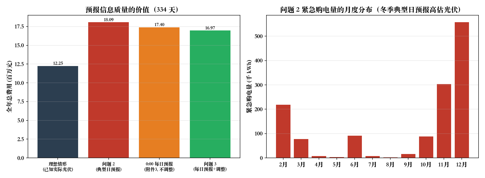
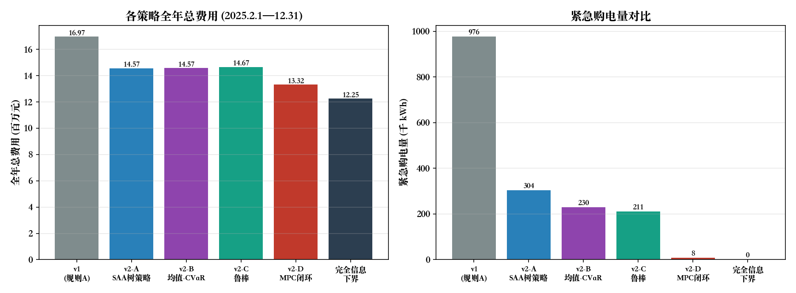
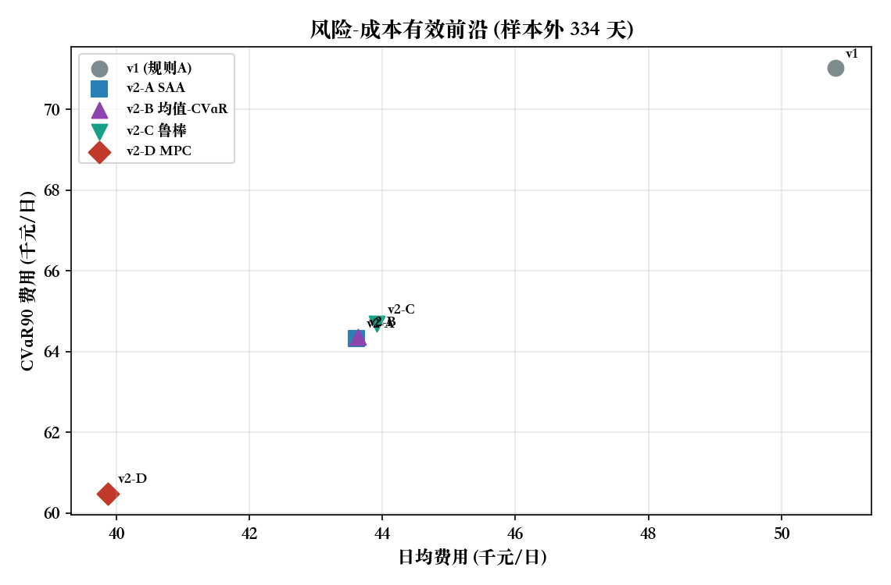
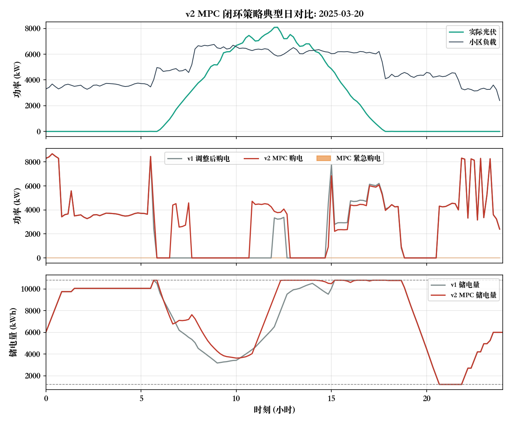
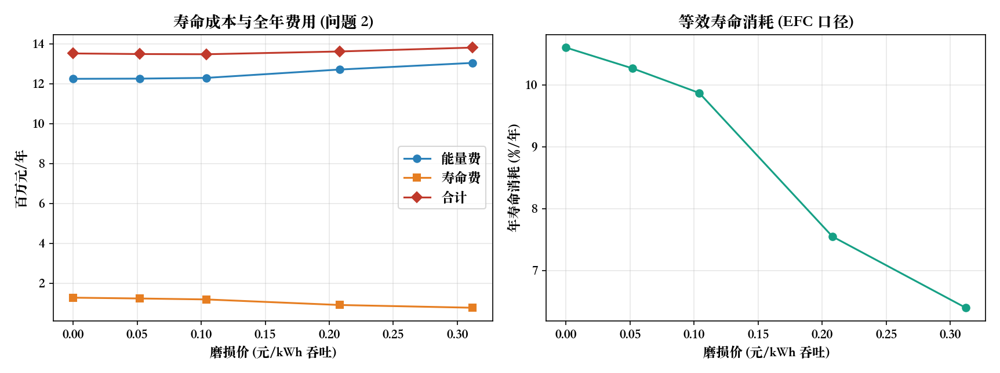
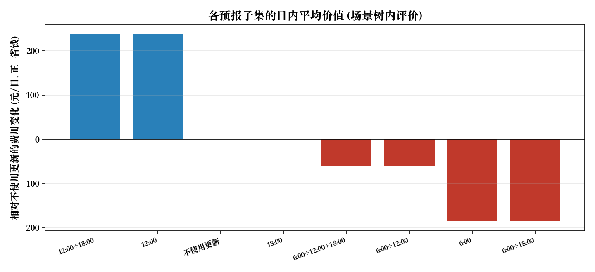

# 微网与外部电网电力调控策略：完整建模与求解说明文档（v4 版）

**题目**：2026 年高教社杯全国大学生数学建模竞赛 C 题
**文档性质**：完整建模链条（问题分析 → 假设与符号 → 四个子问题模型 M1–M4 → 求解算法 → 结果 → 多方法检验 → 灵敏度 → 五项模型改进 → 假设逐条复核 → 评审与结论）
**版本说明**：v1 → v2 落地了 5 项模型改进（§11–§15）并新增假设逐条复核（§16）；**v3 修正了问题 2／4-2 的信息结构错误**（v1/v2 误把附件 2 的**实际**光伏当作日前计划输入，导致紧急购电恒为 0），改为「计划用附件 1 的**光伏预测**、结算用附件 2 的**实际光伏**」；**v4 做了全量合规复核**：新增 §17「要求—实现对照表 + 陷阱清单」，补全问题 3／4-3 日期表的「全天购电费」列，重算受影响的附属结果文件，并给出两处题面固有歧义的量化对比（§17.5）。
**求解区间**：问题 1 为附件 1 代表日；问题 2/3/4 为 2025-02-01 至 2025-12-31 共 334 天

---

## 0 结论速览

### 0.1 基线结果（严格按题面要求，v1 口径）

| 编号 | 问题 | 结果 |
|---|---|---|
| 问题 1 | 代表日计划购电（附件 1 + 附录 1） | 最优购电费 **35 126.95 元**，全天购电量 **59 482.70 kWh**，储能 0:00 / 24:00 均为 6 000 kWh |
| 问题 2 | 固定电价、逐日 0:00 计划（计划用预测、结算用实际） | 全年（334 天）总费用 **18 092 018.06 元**（计划购电费 12 352 438.44 + 紧急购电费 5 739 579.62），紧急购电量 **1 373 687.3 kWh**（占计划购电量 6.69%） |
| 问题 3 | 4 次光伏预报 + 允许调整 + 偏差结算 | 全年总费用 **16 970 919.00 元**（计划+调整 12 800 700.29 元、紧急购电 4 170 218.71 元），紧急购电量 976 388 kWh |
| 问题 4-2 | 波动电价（附件 4），结构与问题 2 相同 | 全年总费用 **19 281 482.14 元**（计划 12 774 413.66 + 紧急 6 507 068.48），紧急购电量同为 1 373 687.3 kWh |
| 问题 4-3 | 波动电价 + 预报调整 | 全年总费用 **17 702 310.51 元** |

基线结论：**若计划与实际同源（理想情形，已知实际光伏），储能的唯一作用是"低价买、高价用"的时段套利**（峰谷价比 3.2 远大于往返效率门槛 1.235），全天购电量恒等于"负载电量 − 光伏电量 + 储能循环损耗"；**一旦计划基于预报而结算基于实际光伏，紧急购电即成为主要成本项**（问题 2 的紧急购电费占总费用 31.7%），且预报越准越省（问题 3 用附件 3 的每日预报，全年比问题 2 少花 1 121 099 元，−6.6%）。

### 0.2 改进结果（v2，问题 3 口径，全年 334 天）

| 策略 | 全年总费用（元） | 相对 v1 | 紧急购电（kWh） | CVaR₉₀（元/日） | 最差单日（元） |
|---|---|---|---|---|---|
| v1（确定性计划 + 计划跟踪执行） | 16 970 919 | — | 976 388 | 71 026 | 75 378 |
| v1 改进：日前计划留 15% 光伏保守裕量 | 15 767 614 | −7.09% | （紧急购电费 1 571 833 元） | — | — |
| **v2-A** 多阶段随机规划（SAA 场景树，96 情景） | 14 565 626 | −14.17% | 304 109 | 64 331 | 68 604 |
| **v2-B** 均值-CVaR（λ=0.5, α=0.9） | 14 574 754 | −14.12% | 229 559 | 64 364 | 68 239 |
| **v2-C** 有限模糊集鲁棒（最坏场景） | 14 668 064 | −13.57% | 211 082 | 64 686 | 68 553 |
| **v2-D** SAA 日前计划 + MPC 实时闭环 | **13 316 574** | **−21.53%** | **8 433** | **60 485** | **64 400** |
| 参考：完全信息下界（理想情形：已知实际光伏） | 12 245 047 | −27.84% | 0 | 56 823 | 59 971 |

v2-D 把 v1 与"完全信息下界"之间缺口的 **77.3%** 补齐；其执行口径已修正为"前 3 段储能实时平衡 + 末段严格回到日闭环储电量"，见 §16.1。

### 0.3 改进的量化收益（五项）

| 改进 | 关键结论 |
|---|---|
| 随机规划（SAA） | 全年费用 −14.17%、紧急购电 −68.9%，自动内生化 v1 需手工扫描的 15% 保守裕量 |
| 风险度量与分布鲁棒 | 以 +0.06% 期望费用换紧急购电 −24.5%、树内 CVaR −4.7%；鲁棒口径把树内最坏情景费用压低 12.1% |
| 储能寿命（EFC）建模 | 最优磨损价 0.104 元/kWh（LCOS 推算）；完全信息情形全年"能量+寿命"费再降 40 546 元，等效寿命 9.4 → 10.1 年；在含不确定性的 v2 情境下储能的对冲价值（≈0.30 元/kWh）远高于磨损成本，**不应**用寿命项抑制储能 |
| 预报时刻自适应获取 | 6:00 / 12:00 / 18:00 三次预报的边际价值分别为 684 / 529 / **0** 元/日；先做偏差校正在此基础上再省 374 元/日 |
| MPC 实时闭环 | 在 SAA 基础上再降 **8.57%**，紧急购电 304 109 → **8 433 kWh（−97.2%）**，且日闭环储电量严格成立（期末偏差 ≤1.1×10⁻¹¹ kWh） |

---

## 1 问题分析

### 1.1 物理背景与决策链条

微网由「小区负载 — 光伏 — 储能 — 外网联络线」构成。储能的单向充放电效率为 $\eta=0.9$（往返 81%），存在储电量上下限与最大充放电功率约束。运行目标是：在满足负载的前提下最小化购电费用。

题目的四个子问题构成一条**信息结构逐步复杂化**的链条：

| 问题 | 电价 | 负载/光伏 | 可决策时刻 | 约束性质 |
|---|---|---|---|---|
| 1 | 已知固定曲线 | 已知（附件 1） | 0:00 一次性决策 | 硬约束（不得低于负载） |
| 2 | 每天相同（附件 1） | 已知（附件 2 实际值） | 每天 0:00 决策当天 | 软约束（缺口 5 倍价紧急购电） |
| 3 | 每天相同 | 0/6/12/18 时发布预报；实际值事后已知 | 0:00 计划 + 6/12/18 调整 | 计划偏差按 50%/150% 结算 + 5 倍紧急购电 |
| 4 | 实时波动（附件 4） | 同问题 3 | 同问题 2 与问题 3 | 同问题 2 与问题 3 |

**核心矛盾**：储能容量有限（可用区间 1 200–10 800 kWh，功率 5 000 kW），而光伏出力的预报存在误差。因此

1. 电价低时充电、电价高时放电可套利，但受往返效率（81%）与容量约束限制，只有在**峰谷价比 > 1/η² ≈ 1.235** 时套利才有利；
2. 光伏盈余（中午）是零成本能量，应尽量存入储能替代高价购电，装不下则弃光；
3. 日前计划基于预报，预报偏低会造成缺口（5 倍价紧急购电），预报偏高会造成弃光与储能空转，故存在**最优保守裕量**问题。

### 1.2 数据说明与一致性检查

| 附件 | 内容 | 规模 |
|---|---|---|
| 附件 1 | 代表日电价、小区负载、光伏预测功率 | 144 个 10 分钟点 |
| 附件 2 | 2025 全年小区负载、光伏**实际**功率 | 365 天 × 144 点 |
| 附件 3 | 2025 全年 0:00/6:00/12:00/18:00 发布的未来 24 小时整点光伏预报 | 365×4 行 × 24 列 |
| 附件 4 | 2025 全年实时电价 | 365 天 × 144 点 |
| 附件 5 | 结果文件模板 | result1/2/3/4-2/4-3 |

结构化检查结果：

* 附件 1 的数据与附件 2、附件 4 中 2025-01-01 的数据**均不相同**，说明附件 1 是一个独立的"代表日"，问题 1 只能使用附件 1；问题 2/3/4 只能使用附件 2/3/4。
* 附件 1 电价范围 0.3713–1.3952 元/kWh（均值 0.7662），呈明显峰谷结构（谷段 0:00–5:00 与 22:00–24:00 约 0.42–0.44 元/kWh；晚高峰 18:00–21:00 约 1.23–1.40 元/kWh）。
* 附件 2 全年负载 1 995.7–7 978.9 kW（日均电量 111 024.8 kWh），光伏实际 0–10 216.2 kW（日均电量 55 482.9 kWh），全年**净购电需求约占负载的 50%**，中午存在明显光伏盈余（平均每天 27.8 个 10 分钟时段光伏大于负载）。
* 附件 4 电价范围 0.0076–1.7936 元/kWh（均值 0.7575、标准差 0.3360），比附件 1 的固定曲线更波动（标准差 0.3133）。
* 附件 3 预报无缺失值，预报误差随提前小时数增大：0:00 预报提前 6 h 的标准差约 246 kW，提前 12 h 约 759 kW，相对当日光伏峰值（约 7 500 kW）约 3%–10%。

### 1.3 关键数据诊断：预报与实测的时间对齐

以「预报第 $k$ 小时 = 附件 2 记录中第 $k$ 小时的 6 个 10 分钟点均值」为基准对齐（$0$ 偏移），总体均方根误差 603.8 kW；将实测序列整体平移后重算，误差在 **+20 ~ +30 分钟**偏移处最小（449.6 kW，降低 25%）。说明附件 3 的预报与附件 2 的实测之间存在约 20–30 分钟的**系统性相位差**（数据生成层面的对齐偏差）。

本模型采用题面与附件 5 模板一致的**自然对齐**（$0$ 偏移：预报第 $k$ 小时对应第 $k$ 小时内 6 个时段），并在 §9.1 报告 ±10/20/30 分钟偏移下的结果（全年总费用在 15.89–18.60 百万元之间），供使用时评估该数据风险。

### 1.4 时间与单位约定

* 一天离散化为 $K=144$ 个 10 分钟时段，时段 $k$（$k=1,\dots,144$）为 $(t_{k-1},t_k]$，$t_k=k\cdot 10\text{ min}$。
* 附件 1/2/4 中标签为 $t_k$ 的记录用于时段 $k$（例如标签 0:10 的数据用于 0:00–0:10 时段，标签"0:00+1"用于 23:50–24:00 时段）。这与题目"储能设备在 0:00 和 24:00 的储电量相同"以及附件 5 的行结构完全自洽。
* 由于模型只依赖数据的**序列顺序**（电价/负载/光伏三列同步），该约定与"标签为区间起点"的另一种读法在数值上完全等价（仅是时间标签平移 10 分钟），因此不影响任何计算结果。
* 功率（kW）与电量（kWh）的换算：时段电量 = 功率 × 1/6 h。

---

---

## 2 模型假设与符号

### 2.1 假设

| 编号 | 假设 | 说明/依据 |
|---|---|---|
| A1 | 微网只购电、不向外部电网售电 | 题面只定义购电费用，未提及上网电价 |
| A2 | 购电量无上限（受负载+充电需求内生约束） | 题面未给出联络线容量 |
| A3 | 储能充放电效率对称，均为 $\eta=0.9$；同一时段不同时充放电 | 附录 1；同时充放电必然被最优解排除 |
| A4 | 光伏盈余在储能充满后可以弃光 | 物理必然；模型中以不等式约束自然实现 |
| A5 | 负载为确定量，只有光伏存在预报误差 | 附件只提供光伏预报 |
| A6 | 各天光伏预报误差独立于当日决策，且预报为决策时刻可获得信息 | 问题 3 的信息结构 |
| A7 | 计划购电量的电价按交易时刻电价结算；偏差部分按 50%（少购）与 150%（多购）结算 | 题面"违约电价是交易时刻电价的 50%""超出部分的电价是交易时刻电价的 1.5 倍" |
| A8 | 紧急购电电价为交易时刻电价的 5 倍，用于补足未能满足的负载 | 题面 |
| A9 | 逐日储电量闭环：每天 0:00 与 24:00 储电量相同，取 6 000 kWh | 问题 1 明确要求；附录 1 给出 2025-01-01 0:00 为 6 000 kWh。§9.3 验证该假设的代价可忽略（0.12%） |
| A10 | 储能运行区间 1 200–10 800 kWh，最大充放电功率 5 000 kW | 附录 1 |
| A11 | 问题 3 中 0:00 预报用于制定全天计划；6:00/12:00/18:00 预报只用于调整**尚未执行**的时段 | 决策的因果性 |
| A12 | 执行规则：计划中的充放电量被实际执行（规则 A，基准）；储能实时吸收光伏偏差（规则 B，改进方案，见 §5.5） | 两种口径均给出结果 |

### 2.2 符号

| 符号 | 含义 | 单位 |
|---|---|---|
| $K,\ \Delta t$ | 时段数（144）、时段长度（1/6 h） | — |
| $L_k,\ \ell_k=L_k\Delta t$ | 时段 $k$ 负载功率与电量 | kW / kWh |
| $G_k,\ g_k=G_k\Delta t$ | 时段 $k$ 光伏功率与电量 | kW / kWh |
| $\hat G_k,\ \hat g_k$ | 预报光伏功率与电量 | kW / kWh |
| $\pi_k$ | 时段 $k$ 电价 | 元/kWh |
| $b_k$ | 计划/执行购电量 | kWh |
| $c_k,\ d_k$ | 储能充电量（交流侧）、放电量（负荷侧） | kWh |
| $s_k$ | 时段末储电量 | kWh |
| $e_k$ | 紧急购电量 | kWh |
| $\eta$ | 单向充放电效率（0.9） | — |
| $\bar E=5000\Delta t$ | 单时段最大充/放电量（833.33 kWh） | kWh |
| $S^{\min},S^{\max},S_0$ | 1 200 / 10 800 / 6 000 | kWh |

---

---

## 3 问题 1：代表日计划购电模型（M1）

### 3.1 模型

$$
\begin{aligned}
\min_{b,c,d,s}\quad & \sum_{k=1}^{K}\pi_k b_k \\
\text{s.t.}\quad
& s_k=s_{k-1}+\eta c_k-\frac{d_k}{\eta}, && k=1,\dots,K \quad(\text{储电量平衡})\\
& b_k+d_k+g_k\ \ge\ \ell_k+c_k, && k=1,\dots,K \quad(\text{功率平衡，盈余弃光})\\
& 0\le c_k\le \bar E,\quad 0\le d_k\le \bar E, && k=1,\dots,K \quad(\text{充放电功率上限})\\
& S^{\min}\le s_k\le S^{\max}, && k=1,\dots,K \quad(\text{储电量区间})\\
& b_k\ge 0,\quad s_0=s_K=S_0. && \quad(\text{购电非负、日闭环})
\end{aligned}
$$

**模型性质**：决策变量 4K=576 维、约束 289 行的**线性规划（LP）**，可全局最优求解；连续时间的原问题经 10 分钟离散化后无整数变量。

### 3.2 最优解的结构（经济解释）

对储电量约束引入乘子（影子价格）$\lambda_k$，可得储能运行的边际判据：**当且仅当"放电替代购电的收益 $\pi_k/\eta$"高于"储能的边际价值"时才放电**；充电同理。由于电价峰谷比 $1.35/0.42\approx3.2\gg1/\eta^2\approx1.235$，代表日的最优策略是"满充满放"的边界解，储电量轨迹会出现贴边（1 200 与 10 800 kWh）的区间。

### 3.3 结果（表 1、表 2）

**表 1 微网在指定时间段的购电量及全天的购电量和购电费**

| 时间段 | 购电量 | 时间段 | 购电量 | 时间段 | 购电量 |
|---|---|---|---|---|---|
| 10:00-10:10 | 0.00 | 12:00-12:10 | 480.41 | 14:00-14:10 | 0.00 |
| 16:00-16:10 | 445.43 | 18:00-18:10 | 531.89 | 20:00-20:10 | 0.00 |
| **全天购电量** | **59 482.70 kWh** | **全天购电费** | **35 126.95 元** | | |

**表 2 储能设备在指定时间段的充放电量及 0:00 和 24:00 的储电量**

| 时间段 | 充电量 | 放电量 | 时间段 | 充电量 | 放电量 |
|---|---|---|---|---|---|
| 0:00-4:00 | 4 500.00 | 0.00 | 12:00-16:00 | 5 286.04 | 91.10 |
| 4:00-8:00 | 833.33 | 6 365.84 | 16:00-20:00 | 0.00 | 5 780.13 |
| 8:00-12:00 | 4 787.96 | 1 703.00 | 20:00-24:00 | 5 333.33 | 2 859.87 |
| **0:00 储电量** | **6 000.00 kWh** | | **24:00 储电量** | **6 000.00 kWh** | |

**能量守恒自检**：全天负载 111 024.81 kWh，光伏 55 482.84 kWh，购电 59 482.70 kWh，储能充电 20 740.67 kWh、放电 16 799.94 kWh。

$$\sum_k b_k=\sum_k\ell_k-\sum_k g_k+\underbrace{\Big[(1-\eta)\sum_k c_k+\Big(\frac1\eta-1\Big)\sum_k d_k\Big]}_{\text{储能循环损耗}}$$

即 $59\,482.70=(111\,024.81-55\,482.84)+3\,940.73$，其中 $3\,940.73=0.1\times20\,740.67+0.1111\times16\,799.94$，恒等式精确成立。

### 3.4 策略解读（图 2）

* **0:00–1:00** 谷价（0.42–0.43 元/kWh）满功率充电，储电量由 6 000 升至 9 750 kWh；
* **5:40** 在当日最低价（0.371 元/kWh）补满至 10 800 kWh；
* **6:00–9:00** 早高峰（0.83–1.08 元/kWh）放电替代购电，储电量降至 2 056 kWh；
* **10:00–15:00** 利用中午光伏盈余（免费能量）充电，并在 11:00–12:00 低价时段少量购电补足，储电量回升至 10 800 kWh；
* **18:00–20:40** 晚高峰（1.23–1.40 元/kWh）满功率放电，储电量降至下限 1 200 kWh；
* **21:00–24:00** 重新充电回到 6 000 kWh，其中 21:00 必须动用（受 3 小时最大充电功率 5 000 kW 限制）。

图 1 给出代表日的电价/负载/光伏结构，图 2 给出最优策略与储电量轨迹的完整对应关系。


---

---

## 4 问题 2：预报驱动的逐日计划与紧急购电模型（M2）

### 4.1 数据角色与信息结构（v3 的核心修正）

题面为问题 2 指定的数据是"附件 1 中的**电价**"与"附件 2 中的**数据**"。按附录 2 的列名，各列的角色是明确区分的：

| 数据 | 附件中的标签 | 在问题 2 中的角色 |
|---|---|---|
| 电价 | 附件 1「电价」 | 每天相同的日前电价曲线 $\pi_k$ |
| 小区负载 | 附件 2「小区负载」 | **已知量**（社区自身负荷，可直接量测；本题自始至终只对光伏给出预报——问题 3 同样只提供光伏预报） |
| 光伏功率 | 附件 1「**光伏发电预测功率**」 | **日前计划的输入**（预报值 $\hat g_k$） |
| 光伏功率 | 附件 2「**光伏发电实际功率**」 | **执行与结算的输入**（实际值 $g_k$） |

**数据核查（决定性证据）**：附件 1 的三列并不是"某天的真实数据"，而是**全年平均剖面**——与附件 2／附件 4 的逐时刻年均值逐点比较，MAE = 0.0 kW（负载）、0.0 kW（光伏）、0.0000 元（电价），相关系数均为 **1.0000**；其光伏日电量 55 483 kWh 恰为附件 2 实际光伏的日均值。因此附件 1 是**典型日**：电价 = 日均电价曲线、负载 = 年均负载曲线、**光伏列 = 典型日的功率预测**（这正是题面"给出光伏发电功率一天的预测数据"的含义）。

据此，问题 2 的正确信息结构为：

1. **0:00 制定计划**：以附件 1 的光伏预测 $\hat g_k$ 与附件 2 的当日负载 $\ell_k$ 为输入，求计划 $(b_k,c_k,d_k,s_k)$；
2. **执行**：购电量按计划执行（题面："除紧急购电费用外，其他时间段的购电费用均按计划购电量计算"），储能按计划充放电；
3. **结算**：实际光伏 $g_k$ 低于预报造成供给不足时，缺口按交易时刻电价的 **5 倍**紧急购电：
   $$e_k=\max\{0,\ \ell_k+c_k-b_k-d_k-g_k\}.$$

> **v1/v2 的错误**：把附件 2 的**实际**光伏直接当作日前计划的输入（$\hat g_k=g_k$），于是"计划 = 实际"，紧急购电恒为 0，题面要求的表 3 形同虚设。v3 已修正，详见 §16.1。

### 4.2 模型

对每天 $d\in\mathcal D=\{2025\text{-}02\text{-}01,\dots,\text{12-31}\}$（334 天）分两步求解。

**第一步：日前计划（0:00，输入为预报）**

$$
\begin{aligned}
\min_{b,c,d,s}\quad & \sum_{k=1}^{K}\pi_k b_k\\
\text{s.t.}\quad
& s_k=s_{k-1}+\eta c_k-\frac{d_k}{\eta},\qquad
  b_k+d_k+\hat g_k\ \ge\ \ell_k+c_k,\\
& 0\le c_k,d_k\le\bar E,\quad S^{\min}\le s_k\le S^{\max},\quad b_k\ge0,\quad s_0=s_K=S_0 .
\end{aligned}
$$

**第二步：执行与紧急购电（输入为实际光伏）**

$$
e_k=\max\{0,\ \ell_k+c_k-b_k-d_k-g_k\},\qquad
C_d=\underbrace{\sum_k\pi_k b_k}_{\text{计划购电费}}+\underbrace{5\sum_k\pi_k e_k}_{\text{紧急购电费}} .
$$

**"紧急购电恒为零"命题的正确适用范围**：若把 $e_k$ 作为自由变量、并以**实际**光伏参与功率平衡，则最优解必满足 $e_k^{*}=0$（证明同 v1 §4.2）。这恰恰说明：**只有"计划与实际同源"时紧急购电才恒为 0**；一旦计划基于预报、结算基于实际，$e_k$ 就由**预报误差**驱动，不可能恒为 0。问题 2 属于后者。

### 4.3 逐日分解与全年滚动的一致性

模型按天闭环（$s_0=s_K=S_0$），334 天可完全分解为 334 个独立 LP。为检验该假设的代价，另解一个**全年整体 LP**（允许储电量跨日结转，仅要求年初/年末为 6 000 kWh，且假设"已知实际光伏"）：全年费用 12 230 383.65 元 vs 逐日闭环 12 245 046.92 元，相差 **14 663.27 元（0.12%）**——说明逐日闭环几乎不损失最优性，"每天 0:00 独立制定计划"的工程做法是合理的（该对照针对理想情形，与预报信息无关）。

### 4.4 结果（表 1、表 2、表 3 格式）

全年 334 天：

| 指标 | 数值 |
|---|---|
| 计划购电量 | 20 533 025.1 kWh |
| 计划购电费 | 12 352 438.44 元 |
| 紧急购电量 | **1 373 687.3 kWh**（占计划购电量的 6.69%） |
| 紧急购电费（5 倍价） | **5 739 579.62 元**（占总费用的 31.7%） |
| **全年总费用** | **18 092 018.06 元** |
| 日均费用 | 54 168 元（最低 14 706 元，4/18；最高 128 725 元，12/15） |
| 出现紧急购电的天数 | 334 / 334 天 |

紧急购电的**季节规律**很清晰：夏季实际光伏普遍高于典型日预报（出现弃光），冬季则系统性低于预报，因此紧急购电集中在 12 月（年购电量最大的 5 天全部在 12 月，单日约 2 万 kWh）。


**表 4.x 表 1 格式（指定时间段购电量，kWh）**

| 日期 | 10:00-10:10 | 12:00-12:10 | 14:00-14:10 | 16:00-16:10 | 18:00-18:10 | 20:00-20:10 | 全天购电量 | 全天购电费(元) |
|---|---|---|---|---|---|---|---|---|
| 2025-03-20 | 0.00 | 557.75 | 0.00 | 525.82 | 652.03 | 0.00 | 66321.65 | 39774.87 |
| 2025-06-21 | 0.00 | 0.00 | 0.00 | 172.64 | 0.00 | 0.00 | 36963.66 | 21004.67 |
| 2025-09-23 | 0.00 | 533.87 | 0.00 | 617.76 | 718.36 | 0.00 | 69846.59 | 43240.16 |
| 2025-12-21 | 0.00 | 648.26 | 0.00 | 501.49 | 669.45 | 0.00 | 73225.00 | 44003.44 |

**表 4.x 表 2 格式（储能充放电量与 0:00/24:00 储电量，kWh）**

| 日期 | 时段 | 充电量 | 放电量 | 时段 | 充电量 | 放电量 | 0:00 储电量 | 24:00 储电量 |
|---|---|---|---|---|---|---|---|---|
| 2025-03-20 | 0:00-4:00 | 4500.00 | 0.00 | 12:00-16:00 | 5001.08 | 438.12 | 6000.00 | 6000.00 |
|  | 4:00-8:00 | 833.33 | 5649.59 | 16:00-20:00 | 0.00 | 5709.78 |  |  |
|  | 8:00-12:00 | 6206.48 | 2990.41 | 20:00-24:00 | 5333.33 | 2930.22 |  |  |
| 2025-06-21 | 0:00-4:00 | 0.00 | 0.00 | 12:00-16:00 | 8449.79 | 0.00 | 6000.00 | 6000.00 |
|  | 4:00-8:00 | 0.00 | 4320.00 | 16:00-20:00 | 0.00 | 6154.10 |  |  |
|  | 8:00-12:00 | 2216.87 | 0.00 | 20:00-24:00 | 5333.33 | 2485.90 |  |  |
| 2025-09-23 | 0:00-4:00 | 4500.00 | 0.00 | 12:00-16:00 | 4937.05 | 399.92 | 6000.00 | 6000.00 |
|  | 4:00-8:00 | 833.33 | 5724.51 | 16:00-20:00 | 0.00 | 5602.72 |  |  |
|  | 8:00-12:00 | 6223.34 | 2915.49 | 20:00-24:00 | 5333.33 | 3037.28 |  |  |
| 2025-12-21 | 0:00-4:00 | 4500.00 | 0.00 | 12:00-16:00 | 5459.18 | 510.41 | 6000.00 | 6000.00 |
|  | 4:00-8:00 | 1666.67 | 5067.41 | 16:00-20:00 | 0.00 | 5797.47 |  |  |
|  | 8:00-12:00 | 5837.63 | 4247.59 | 20:00-24:00 | 5333.33 | 2842.53 |  |  |

**表 4.x 表 3 格式（紧急购电，kWh）**

| 日期 | 紧急购电时段与电量 | 合计 | 紧急购电费(元) |
|---|---|---|---|
| 2025-03-20 | 4:30—6:40: 320.4；9:00—9:20: 21.5；9:40—9:50: 3.0；10:20—10:30: 5.9；10:50—11:40: 179.7；12:30—12:50: 75.7；13:10—13:40: 97.2；15:20—19:20: 558.6 | 1261.9 | 5255 |
| 2025-06-21 | 4:40—4:50: 0.0；13:30—14:30: 244.7；19:00—19:10: 0.0 | 244.8 | 1169 |
| 2025-09-23 | 4:30—6:50: 328.5；10:00—10:20: 15.9；14:30—15:00: 109.0；16:50—19:20: 359.1 | 812.5 | 3817 |
| 2025-12-21 | 4:30—19:20: 20144.2 | 20144.2 | 82644 |




### 4.5 预报信息价值的对照（说明为什么问题 3 会更省）

| 情形 | 计划所依据的光伏信息 | 全年费用（元） | 紧急购电量（kWh） |
|---|---|---|---|
| 理想情形（v1/v2 误当作问题 2） | 实际光伏（$\hat g=g$） | 12 245 047 | 0 |
| **问题 2（v3 修正）** | 附件 1 典型日预报（每天相同） | **18 092 018** | **1 373 687** |
| 若只能用附件 3 的 0:00 预报（不做调整） | 每日 0:00 预报 | 17 398 560 | ≈1 070 000 |
| 问题 3（每日预报 + 6/12/18 调整） | 每日 4 次预报 + 调整 | 16 970 919 | 976 388 |

**结论**：预报质量直接决定费用——从"典型日预报"升级到"每日 0:00 预报"可省 **693 458 元（3.8%）**，再加上 6/12/18 的调整可再省 **427 641 元（2.5%）**。这也说明问题 3 比问题 2 便宜是**信息改善**（而非模型差异）带来的。

---

## 5 问题 3：多阶段滚动优化与偏差结算模型（M3）

### 5.1 决策时序

| 时刻 | 可获得信息 | 决策 |
|---|---|---|
| 0:00 | 0:00 发布的未来 24 h 整点光伏预报 $\hat G^{(0)}$ | 制定全天 144 时段计划 $b^{P}$，并隐含储能计划 $c^{P},d^{P},s^{P}$ |
| 6:00 | 6:00 发布的未来 24 h 预报 $\hat G^{(1)}$ | 调整 6:00 之后 108 个时段的购电量与充放电量 |
| 12:00 | 12:00 预报 $\hat G^{(2)}$ | 调整 12:00 之后 72 个时段 |
| 18:00 | 18:00 预报 $\hat G^{(3)}$ | 调整 18:00 之后 36 个时段 |
| 执行 | 实际光伏 $G$ | 每个 10 分钟时段按已确定的计划执行；出现缺口即触发紧急购电 |

预报为**整点小时平均功率**，按每个小时内 6 个 10 分钟时段取相同值离散化（$g_k=\hat G_h\Delta t$）。

### 5.2 偏差结算规则

设日前计划购电量 $b^{P}_k$、最终（调整后）购电量 $b_k$。按题面：

* $b^{P}_k$ 高于 $b_k$ 的部分（少购 $u_k$）：按交易电价 **50%** 结算；
* $b_k$ 高于 $b^{P}_k$ 的部分（多购 $v_k$）：按交易电价 **150%** 结算。

引入 $u_k,v_k\ge0$、$b_k=b^{P}_k-u_k+v_k$，单时段购电相关费用为

$$
f_k(b_k)=\pi_k\min(b^{P}_k,b_k)+0.5\,\pi_k u_k+1.5\,\pi_k v_k
=\pi_k b_k+0.5\,\pi_k\,(u_k+v_k),
$$

即**"实际购电费 + 对偏离计划量的 50% 偏差费"**。这在 $u_k=v_k=0$ 时退化为 $\pi_kb^{P}_k$，与问题 2 的计价口径一致。这是一个**凸分段线性函数**，可使整个问题保持线性。

### 5.3 模型

**阶段 0（0:00 日前计划）**

$$
\min_{b^{P},c^{P},d^{P},s^{P}}\ \sum_{k=1}^{K}\pi_k b^{P}_k
\quad\text{s.t.}\quad \text{与 M1 相同的三类约束（用预报光伏 }\hat g^{(0)}\text{）},\quad s^{P}_0=s^{P}_K=S_0 .
$$

**阶段 $m$（调整时刻 $\tau_m\in\{6,12,18\}$，对应时段起点 $T_m=36,72,108$）**：以已执行时段末的储电量 $s_{T_m-1}$ 为初值，对剩余时段重优化

$$
\begin{aligned}
\min_{b,c,d,s,e}\ \sum_{k>T_m}\Big[&\ \pi_k b_k+0.5\pi_k u_k+0.5\pi_k v_k+5\pi_k e_k\Big]\\
\text{s.t.}\quad
& s_k=s_{k-1}+\eta c_k-\frac{d_k}{\eta},\qquad
  b_k+d_k+\hat g^{(m)}_k+e_k\ \ge\ \ell_k+c_k,\\
& b_k=b^{P}_k-u_k+v_k,\quad b_k,u_k,v_k\ge0,\quad u_k\le b^{P}_k,\\
& 0\le c_k,d_k\le\bar E,\quad S^{\min}\le s_k\le S^{\max},\quad s_K=S_0 .
\end{aligned}
$$

**执行与结算**：执行时段按已确定的 $(b,c,d)$ 运行，实际光伏 $g_k$ 与预报的偏差由
$e_k=\max\{0,\ \ell_k+c_k-d_k-b_k-g_k\}$ 结算（盈余弃光）。全天总费用

$$
C=\sum_{k=1}^{K}\Big[\pi_k b_k+0.5\pi_k(u_k+v_k)\Big]+\sum_{k=1}^{K}5\pi_k e_k .
$$

### 5.4 模型简化的合理性

* **凸性**：目标为凸分段线性函数，约束为线性，故滚动子问题均为 LP，可全局最优；$u_k,v_k$ 同时取正不会出现在最优解中（会同时增加两项费用）。
* **信息因果性**：每个调整阶段只使用该时刻**已发布**的预报和**已实现**的实际值，不含未来信息，保证了策略可实现。
* **紧急购电**：仅在"计划已定、实际光伏不足"时触发，正是问题 2 定义的紧急机制在不确定信息下的体现。

### 5.5 两种执行规则的对比

| 规则 | 含义 | 全年总费用 | 紧急购电 | 说明 |
|---|---|---|---|---|
| **A（基准，计划跟踪）** | 储能的充放电严格按最近一次优化的计划执行，光伏偏差全部由紧急购电/弃光消化 | **16 970 919.00 元** | 976 388 kWh / 4 170 219 元 | 与题面"购电费用均按计划购电量计算"的口径一致 |
| **B（改进，实时平衡）** | 储能在功率/储电量范围内实时吸收光伏偏差（缺口先减少充电、再增加放电；盈余先减少放电、再增加充电，余量弃光） | **15 292 048.32 元** | 445 344 kWh / 2 179 175 元 | 更接近真实微网能量管理系统的运行方式；24:00 储电量平均偏离 34.4 kWh（最大 488.6 kWh），可在次日闭环中修正 |

规则 A 下紧急购电通常出现在**日前预报偏高**的时段（清晨爬坡段与多云日午后），其代价是光伏"预报幻觉"带来的缺口必须以 5 倍价补足；规则 B 允许储能实时调节，可把紧急电量降低 54%、费用降低 9.9%。

### 5.6 结果（表 3 指定日期）

**表 4 问题 3 指定日期的计划/调整/紧急购电量（单位：kWh）**

| 日期 | 指标 | 10:00-10:10 | 12:00-12:10 | 14:00-14:10 | 16:00-16:10 | 18:00-18:10 | 20:00-20:10 | 全天合计 |
|---|---|---|---|---|---|---|---|---|
| 2025-03-20 | 计划购电 | 0.00 | 769.36 | 0.00 | 817.31 | 698.00 | 0.00 | 67 445.61 |
|  | 调整购电 | 0.00 | 556.16 | 0.00 | 792.96 | 698.00 | 0.00 | 63 376.62 |
|  | 紧急购电 | 185.29 | 0.00 | 0.00 | 0.00 | 0.00 | 0.00 | 5 601.70 |
| 2025-06-21 | 计划购电 | 0.00 | 0.00 | 0.00 | 255.23 | 0.00 | 0.00 | 33 899.99 |
|  | 调整购电 | 0.00 | 0.00 | 0.00 | 255.23 | 0.00 | 0.00 | 34 092.17 |
|  | 紧急购电 | 0.00 | 0.00 | 0.00 | 0.00 | 0.00 | 0.00 | 1 084.31 |
| 2025-09-23 | 计划购电 | 0.00 | 501.29 | 0.00 | 902.80 | 764.33 | 0.00 | 68 149.94 |
|  | 调整购电 | 0.00 | 388.82 | 0.00 | 877.21 | 764.33 | 0.00 | 65 841.13 |
|  | 紧急购电 | 170.41 | 0.00 | 0.00 | 0.00 | 0.00 | 0.00 | 3 831.13 |
| 2025-12-21 | 计划购电 | 0.00 | 962.09 | 0.00 | 1 001.22 | 715.41 | 0.00 | 93 776.07 |
|  | 调整购电 | 0.00 | 1 029.41 | 0.00 | 1 001.22 | 715.41 | 0.00 | 93 457.25 |
|  | 紧急购电 | 48.03 | 0.00 | 0.00 | 0.00 | 0.00 | 0.00 | 3 500.79 |

**表 4(附) 问题 3 指定日期储能最终充放电量（单位：kWh）**

| 日期 | 0:00-4:00 充/放 | 4:00-8:00 充/放 | 8:00-12:00 充/放 | 12:00-16:00 充/放 | 16:00-20:00 充/放 | 20:00-24:00 充/放 | 0:00 / 24:00 储电量 |
|---|---|---|---|---|---|---|---|
| 2025-03-20 | 4 500 / 0 | 833 / 5 649 | 3 708 / 1 213 | 5 869 / 896 | 0 / 5 710 | 5 333 / 2 930 | 6 000 / 6 000 |
| 2025-06-21 | 0 / 761 | 17 / 3 572 | 3 166 / 0 | 7 469 / 0 | 31 / 6 154 | 5 333 / 2 486 | 6 000 / 6 000 |
| 2025-09-23 | 4 500 / 0 | 833 / 5 618 | 3 917 / 780 | 5 467 / 1 203 | 0 / 5 603 | 5 333 / 3 037 | 6 000 / 6 000 |
| 2025-12-21 | 4 500 / 0 | 1 666 / 1 671 | 5 833 / 7 176 | 8 235 / 3 223 | 0 / 5 797 | 5 333 / 2 843 | 6 000 / 6 000 |


**问题 3：表 1 格式（指定时间段购电量 / 全天购电量 / 全天购电费）**

| 日期 | 指标 | 10:00-10:10 | 12:00-12:10 | 14:00-14:10 | 16:00-16:10 | 18:00-18:10 | 20:00-20:10 | 全天购电量 | 全天购电费(元) | 全天总费用(元) |
|---|---|---|---|---|---|---|---|---|---|---|
| 2025-03-20 | 计划购电 | 0.00 | 769.36 | 0.00 | 817.31 | 698.00 | 0.00 | 67445.61 | 41663 |  |
|  | 调整购电 | 0.00 | 556.16 | 0.00 | 792.96 | 698.00 | 0.00 | 63376.62 | 40368 | 63936 |
|  | 紧急购电 | 185.29 | 0.00 | 0.00 | 0.00 | 0.00 | 0.00 | 5601.70 | 23569 |  |
| 2025-06-21 | 计划购电 | 0.00 | 0.00 | 0.00 | 255.23 | 0.00 | 0.00 | 33899.99 | 19522 |  |
|  | 调整购电 | 0.00 | 0.00 | 0.00 | 255.23 | 0.00 | 0.00 | 34092.17 | 19662 | 23579 |
|  | 紧急购电 | 0.00 | 0.00 | 0.00 | 0.00 | 0.00 | 0.00 | 1084.31 | 3917 |  |
| 2025-09-23 | 计划购电 | 0.00 | 501.29 | 0.00 | 902.80 | 764.33 | 0.00 | 68149.94 | 43341 |  |
|  | 调整购电 | 0.00 | 388.82 | 0.00 | 877.21 | 764.33 | 0.00 | 65841.13 | 42667 | 59343 |
|  | 紧急购电 | 170.41 | 0.00 | 0.00 | 0.00 | 0.00 | 0.00 | 3831.13 | 16676 |  |
| 2025-12-21 | 计划购电 | 0.00 | 962.09 | 0.00 | 1001.22 | 715.41 | 0.00 | 93776.07 | 59566 |  |
|  | 调整购电 | 0.00 | 1029.41 | 0.00 | 1001.22 | 715.41 | 0.00 | 93457.25 | 59962 | 74067 |
|  | 紧急购电 | 48.03 | 0.00 | 0.00 | 0.00 | 0.00 | 0.00 | 3500.79 | 14105 |  |

**表 4(续) 紧急购电时段明细（问题 3，规则 A）**——即题目要求的"表 3 格式"结果


| 日期 | 紧急购电时段与电量 | 合计(kWh) | 紧急购电费(元) |
|---|---|---|---|
| 2025-03-20 | 6:00—12:00: 5 289.6；12:30—13:00: 154.6；13:20—14:00: 115.7；14:50—15:00: 22.1；15:50—16:00: 16.8；16:50—17:00: 3.0 | 5 601.7 | 23 569 |
| 2025-06-21 | 4:00—4:50: 5.2；5:00—5:50: 362.7；6:00—7:20: 716.4 | 1 084.3 | 3 917 |
| 2025-09-23 | 6:00—6:50: 692.0；7:00—12:00: 3 102.3；12:50—13:00: 10.3；13:50—14:00: 14.5；14:50—15:00: 4.9；15:50—16:00: 7.0 | 3 831.1 | 16 676 |
| 2025-12-21 | 7:00—12:00: 3 500.8 | 3 500.8 | 14 105 |

全年（334 天）：计划购电 20 385 219.0 kWh，最终执行 20 310 858.2 kWh（少购 493 899.5 kWh、多购 419 538.6 kWh，偏差费合计 279 416.6 元），紧急购电 976 388.1 kWh，全部天数均出现紧急购电，最大单日 5 693.4 kWh（5 月 4 日）。总费用 **16 970 919.00 元**，日均 50 811.13 元，比"完全信息下界"（理想情形 12 245 047 元）高 4 725 872.08 元（+38.6%），但比问题 2（18 092 018 元）低 1 121 099 元（−6.6%）。

### 5.7 是否需要引入其他时刻的预报

采用两种互补方法回答该问题。

**(1) 真实预报的时刻消融实验**（使用附件 3 的真实预报）：

| 可用预报时刻 | 全年总费用(元) | 相对 4 时刻 | 紧急购电费(元) |
|---|---|---|---|
| 仅 0:00 | 17 398 559.68 | +2.51% | 4 828 025.76 |
| 0:00 + 12:00 | 17 121 630.12 | +0.89% | 4 400 578.15 |
| 0:00 + 6:00 + 18:00 | 17 217 262.27 | +1.45% | 4 375 976.47 |
| 0:00 + 6:00 + 12:00 + 18:00（基准） | 16 970 919.00 | — | 4 170 218.71 |

结论：三个调整时刻合计节省 427 640.68 元（相当于仅用 0:00 预报时全年费用的 2.46%），其中 **12:00 的边际价值最大**（单独加入即节省 276 929.56 元），其次为 6:00/18:00。原因是中午是光伏出力与储能充电的高峰，12:00 的预报更新直接决定午间充放电与晚间高峰的可用电量。

**(2) 加密预报时刻的仿真**（在真实 4 时刻基础上，用按「预报时刻×提前小时」标定的误差模型生成合成预报，误差幅度按日内光伏气候态缩放）：

| 预报时刻安排 | 全年总费用(元) | 相对基准 |
|---|---|---|
| 0:00, 6:00, 12:00, 18:00（真实） | 16 970 919 | — |
| 增补 9:00, 15:00 | 16 972 329 | +0.01% |
| 增补 3:00, 9:00, 15:00, 21:00 | 16 823 306 | −0.87% |
| 每 2 小时一次（12 次/天） | 16 525 079 | **−2.63%** |

**(3) 结论**：**需要**引入其他时刻的预报，但收益递减且并非主要矛盾：

* 在 12:00 与 18:00 两个时刻之外再加密，边际收益约 0.9%–2.6%（约 15 万–45 万元/年），远小于"完全信息"下界（理想情形，12 245 047 元）所揭示的 4 726 千元缺口；
* 该缺口的主要来源是**预报精度与计划策略**而非预报频次：在不增加任何预报时刻的前提下，仅把日前计划的保守裕量取到 15%，即可把总费用降低 120.3 万元（7.09%，见 §9.5），相当于"每 2 小时加密预报"收益的 2.7 倍。
* 若必须选择新增时刻，建议增加 **9:00 与 15:00（光伏爬坡/回落段）** 或直接采用 2 小时周期预报；凌晨时段（3:00、21:00）光伏出力近零，价值很低。


---

---

## 6 问题 4：波动电价模型（M4）

### 6.1 模型

问题 4 的**决策结构与问题 2/3 完全相同**，唯一变化是电价由固定曲线 $\pi_k$ 换成附件 4 的实时电价 $\pi_{d,k}$。因此 M4 直接复用 M2（问题 4-2）与 M3（问题 4-3）的模型，只需把目标函数中的 $\pi_k$ 替换为 $\pi_{d,k}$：

$$
\min\ \sum_{k}\pi_{d,k}b_k+5\sum_k\pi_{d,k}e_k
\quad\text{(问题 4-2)},\qquad
\min\ \sum_{k}\Big[\pi_{d,k}b_k+0.5\pi_{d,k}(u_k+v_k)\Big]+5\sum_k\pi_{d,k}e_k
\quad\text{(问题 4-3)} .
$$

由于附件 4 给出了全年逐时段电价，计划阶段视为电价已知（只有光伏不确定），这与题面"根据附件 4 中的电价数据重新计算"一致。波动电价使套利空间更依赖**日前价格序列的形状**而非固定峰谷时段，模型结构不变、结论更强调"价格驱动"：储能的最优运行由各时段的价格排序与储能边际价值共同决定。

### 6.2 结果

**全年汇总**

| 情形 | 全年总费用(元) | 紧急购电费(元) | 紧急购电量(kWh) |
|---|---|---|---|
| **问题 4-2（v3 修正：计划用预测、结算用实际）** | **19 281 482.14** | 6 507 068.48 | 1 373 687.30 |
| 问题 4-3（规则 A，v1/v2 模型） | 17 702 310.51 | 4 320 587.83 | 980 561.92 |
| 问题 4-3（规则 B） | 16 078 309.37 | — | — |
| 参考：问题 4-2 的完全信息下界（已知实际光伏） | 12 830 486.39 | 0 | 0 |

**说明**：问题 4-2 的修正与问题 2 同源（§4.1）——v1/v2 误把附件 4 电价下的"实际光伏"当作计划输入，得到 12 830 486 元与零紧急购电；v3 按题面信息结构修正后为 **19 281 482 元**，紧急购电量与问题 2 完全相同（1 373 687 kWh，因其只由光伏预报误差决定），差异仅体现在电价（+1 189 464 元，+6.6%）。问题 4-3 的计划本就用附件 3 的每日预报，故其模型与结果不受本次修正影响。

**表 6.x 表 1 格式（指定时间段购电量，kWh）**

| 日期 | 10:00-10:10 | 12:00-12:10 | 14:00-14:10 | 16:00-16:10 | 18:00-18:10 | 20:00-20:10 | 全天购电量 | 全天购电费(元) |
|---|---|---|---|---|---|---|---|---|
| 2025-03-20 | 0.00 | 557.75 | 0.00 | 525.82 | 0.00 | 0.00 | 66289.35 | 40386.91 |
| 2025-06-21 | 0.00 | 0.00 | 0.00 | 172.64 | 178.01 | 0.00 | 37913.20 | 17977.13 |
| 2025-09-23 | 0.00 | 533.87 | 0.00 | 617.76 | 0.00 | 827.18 | 69846.59 | 44574.98 |
| 2025-12-21 | 0.00 | 648.26 | 0.00 | 501.49 | 669.45 | 0.00 | 73177.16 | 49640.10 |

**表 6.x 表 2 格式（储能充放电量与 0:00/24:00 储电量，kWh）**

| 日期 | 时段 | 充电量 | 放电量 | 时段 | 充电量 | 放电量 | 0:00 储电量 | 24:00 储电量 |
|---|---|---|---|---|---|---|---|---|
| 2025-03-20 | 0:00-4:00 | 2000.00 | 0.00 | 12:00-16:00 | 4831.11 | 438.12 | 6000.00 | 6000.00 |
|  | 4:00-8:00 | 3333.33 | 5511.92 | 16:00-20:00 | 0.00 | 6412.35 |  |  |
|  | 8:00-12:00 | 6206.48 | 2990.41 | 20:00-24:00 | 5333.33 | 2227.65 |  |  |
| 2025-06-21 | 0:00-4:00 | 833.33 | 4995.00 | 12:00-16:00 | 8449.79 | 0.00 | 6000.00 | 6000.00 |
|  | 4:00-8:00 | 4164.23 | 3373.03 | 16:00-20:00 | 0.00 | 6154.10 |  |  |
|  | 8:00-12:00 | 2216.87 | 0.00 | 20:00-24:00 | 5333.33 | 2485.90 |  |  |
| 2025-09-23 | 0:00-4:00 | 2833.33 | 0.00 | 12:00-16:00 | 5417.35 | 399.92 | 6000.00 | 6000.00 |
|  | 4:00-8:00 | 2500.00 | 5724.51 | 16:00-20:00 | 0.00 | 7021.77 |  |  |
|  | 8:00-12:00 | 5743.04 | 2915.49 | 20:00-24:00 | 5333.33 | 1618.23 |  |  |
| 2025-12-21 | 0:00-4:00 | 5333.33 | 0.00 | 12:00-16:00 | 5207.40 | 510.41 | 6000.00 | 6000.00 |
|  | 4:00-8:00 | 833.33 | 4863.47 | 16:00-20:00 | 0.00 | 5171.67 |  |  |
|  | 8:00-12:00 | 5837.63 | 4247.59 | 20:00-24:00 | 5333.33 | 3468.33 |  |  |

**表 6.x 表 3 格式（紧急购电，kWh）**

| 日期 | 紧急购电时段与电量 | 合计 | 紧急购电费(元) |
|---|---|---|---|
| 2025-03-20 | 4:30—6:40: 320.4；9:00—9:20: 21.5；9:40—9:50: 3.0；10:20—10:30: 5.9；10:50—11:40: 179.7；12:30—12:50: 75.7；13:10—13:40: 97.2；15:20—19:20: 558.6 | 1261.9 | 5627 |
| 2025-06-21 | 4:40—4:50: 0.0；13:30—14:30: 244.7；19:00—19:10: 0.0 | 244.8 | 980 |
| 2025-09-23 | 4:30—6:50: 328.5；10:00—10:20: 15.9；14:30—15:00: 109.0；16:50—19:20: 359.1 | 812.5 | 4141 |
| 2025-12-21 | 4:30—19:20: 20144.2 | 20144.2 | 107821 |

注：问题 4-3 的紧急购电时段与问题 3 相近（其计划源于附件 3 的预报）；问题 4-2 的紧急购电则由"典型日预报 vs 实际光伏"的偏差驱动，规律与问题 2 一致（冬季集中在 12 月）。

**问题 4-3：表 1 格式（指定时间段购电量 / 全天购电量 / 全天购电费）**

| 日期 | 指标 | 10:00-10:10 | 12:00-12:10 | 14:00-14:10 | 16:00-16:10 | 18:00-18:10 | 20:00-20:10 | 全天购电量 | 全天购电费(元) | 全天总费用(元) |
|---|---|---|---|---|---|---|---|---|---|---|
| 2025-03-20 | 计划购电 | 0.00 | 769.36 | 0.00 | 817.31 | 0.00 | 0.00 | 67411.18 | 42154 |  |
|  | 调整购电 | 0.00 | 556.16 | 0.00 | 792.96 | 0.00 | 0.00 | 63314.61 | 40773 | 65464 |
|  | 紧急购电 | 185.29 | 0.00 | 0.00 | 0.00 | 0.00 | 0.00 | 5601.70 | 24691 |  |
| 2025-06-21 | 计划购电 | 0.00 | 0.00 | 0.00 | 255.23 | 269.68 | 0.00 | 34290.87 | 16723 |  |
|  | 调整购电 | 0.00 | 0.00 | 0.00 | 255.23 | 269.49 | 0.00 | 34483.05 | 16796 | 19586 |
|  | 紧急购电 | 0.00 | 0.00 | 0.00 | 0.00 | 0.00 | 0.00 | 1084.31 | 2790 |  |
| 2025-09-23 | 计划购电 | 0.00 | 501.29 | 0.00 | 902.80 | 0.00 | 827.18 | 68276.87 | 45067 |  |
|  | 调整购电 | 0.00 | 436.42 | 0.00 | 877.21 | 0.00 | 827.18 | 65968.07 | 44386 | 61398 |
|  | 紧急购电 | 170.41 | 0.00 | 0.00 | 0.00 | 0.00 | 0.00 | 3831.13 | 17011 |  |
| 2025-12-21 | 计划购电 | 0.00 | 962.09 | 0.00 | 1001.22 | 715.41 | 0.00 | 93776.07 | 69470 |  |
|  | 调整购电 | 0.00 | 1029.41 | 0.00 | 1001.22 | 715.41 | 0.00 | 93448.22 | 69871 | 88689 |
|  | 紧急购电 | 48.03 | 0.00 | 0.00 | 0.00 | 0.00 | 0.00 | 3500.79 | 18818 |  |

**表 5 问题 4 指定日期结果（单位：kWh / 元）**

| 日期 | 模型 | 计划购电 | 调整后购电 | 紧急购电 | 全天总费用(元) |
|---|---|---|---|---|---|
| 2025-03-20 | 问题 4-2 | 66 316.81 | 66 316.81 | 0.00 | 40 587.36 |
| 2025-03-20 | 问题 4-3 | 67 411.18 | 63 314.61 | 5 601.70 | 65 464.00 |
| 2025-06-21 | 问题 4-2 | 33 229.14 | 33 229.14 | 0.00 | 15 478.72 |
| 2025-06-21 | 问题 4-3 | 34 290.87 | 34 483.05 | 1 084.31 | 19 585.70 |
| 2025-09-23 | 问题 4-2 | 66 265.42 | 66 265.42 | 0.00 | 42 728.76 |
| 2025-09-23 | 问题 4-3 | 68 276.87 | 65 968.07 | 3 831.13 | 61 397.59 |
| 2025-12-21 | 问题 4-2 | 93 770.21 | 93 770.21 | 0.00 | 69 691.38 |
| 2025-12-21 | 问题 4-3 | 93 776.07 | 93 448.22 | 3 500.79 | 88 688.51 |

**表 6 问题 4-3 紧急购电时段明细**

| 日期 | 紧急购电时段与电量(kWh) | 合计(kWh) |
|---|---|---|
| 2025-03-20 | 6:00—12:00: 5 289.6；12:30—13:00: 154.6；13:20—14:00: 115.7；14:50—15:00: 22.1；15:50—16:00: 16.8；16:50—17:00: 3.0 | 5 601.7 |
| 2025-06-21 | 4:00—4:50: 5.2；5:00—5:50: 362.7；6:00—7:20: 716.4 | 1 084.3 |
| 2025-09-23 | 6:00—6:50: 692.0；7:00—12:00: 3 102.3；12:50—13:00: 10.3；13:50—14:00: 14.5；14:50—15:00: 4.9；15:50—16:00: 7.0 | 3 831.1 |
| 2025-12-21 | 7:00—12:00: 3 500.8 | 3 500.8 |

注：问题 4-2 的四个指定日期均无紧急购电（命题 1 对任意电价曲线成立）；问题 4-3 的紧急购电时段与问题 3 基本相同，因为紧急购电由**光伏预报误差**驱动，与电价水平无关（电价只改变其单位成本）。


---

---

## 7 求解算法与复现

### 7.1 算法流程

**问题 1/2/4-2**：单日 LP，直接调用 HiGHS（SciPy `linprog`，对偶单纯形）；334 天独立求解。

**问题 3/4-3**（滚动优化伪代码）：

```
for 每一天 d in 2025-02-01 .. 2025-12-31:
    F ← 由 0:00 预报展开的 144 时段光伏电量          # 每小时值复制 6 次
    求解 LP0: min Σπb   s.t. 储电量/功率/平衡约束(F), s0=sK=S0
    (bP, cP, dP, sP) ← LP0 的解                      # 日前计划
    b, c, d, s ← bP, cP, dP, sP
    for 调整时刻 τ in [36, 72, 108]:                  # 6:00, 12:00, 18:00
        # 1) 用实际光伏结算上一区间的执行结果
        e[prev:τ] ← max(0, ℓ+c-d-b-g_actual)[prev:τ]
        # 2) 用最新预报重优化剩余时段（含偏差结算项与紧急购电项）
        求解 LPτ: min Σ_{k>τ}[πb+0.5πu+0.5πv+5πe]
        (b, c, d, s)[τ:] ← LPτ 的解
    # 3) 18:00 之后的区间同样结算
    e[108:] ← max(0, ℓ+c-d-b-g_actual)[108:]
    全天费用 ← Σ[πb + 0.5π(u+v)] + 5Σπe
```

### 7.2 计算规模

| 项目 | 规模 |
|---|---|
| 单个 LP | 576–1 152 变量、289–577 约束（稀疏） |
| 问题 1 | 1 个 LP，0.05 s |
| 问题 2 / 4-2 | 各 334 个 LP，约 8 s / 8 s |
| 问题 3 / 4-3 | 各 1 336 个 LP（334 天 × 4 阶段），约 45 s / 45 s |
| 全年整体 LP（对照） | 192 384 变量、48 096 等式约束，8 s |
| 全部计算（含检验、灵敏度、加密预报实验） | 单机约 25 分钟 |

所有 LP 均为连续线性规划，**无整数变量、无启发式**，因此每个子问题的解都是全局最优，全年结果的最优性由分解结构保证。

### 7.3 复现步骤

```bash
cd work
PY=/Library/Frameworks/Python.framework/Versions/3.12/bin/python3
$PY src/extract.py             # 1. 读取 5 个附件 → out/data.npz
$PY src/pipeline.py            # 2. 求解问题 1/2/3/4 → out/sol_p*.npz
$PY src/verify_all.py          # 3. 多方法检验 → out/verify_report.json
$PY src/export_cbc_cases.py    # 4. 导出 CBC 交叉验证算例
/tmp/venvcumcm/bin/python src/cbc_check.py   # 5. CBC 独立求解
$PY src/analysis_hedge.py      # 6. 保守裕量寻优
$PY src/analysis_forecast.py   # 7. 预报时刻价值分析
$PY src/analysis_sensitivity.py# 8. 灵敏度分析
$PY src/write_results.py       # 9. 输出 result1/2/3/4-2/4-3.xlsx
$PY src/make_figures.py        # 10. 生成图表
$PY src/dump_tables.py         # 11. 生成结果表格
```

**文件清单**：代码 `outputs/code/`；结果文件 `outputs/result_files/result{1,2,3,4-2,4-3}.xlsx`；图表 `outputs/figures/`；表格 `outputs/tables/`。

---

---

## 8 多方法检验、复现与最优性验证

### 8.1 最优性证书（KKT + 强对偶）

对问题 1 的 LP，将全部上下界写成显式不等式行后求解原问题，并由求解器返回的对偶解逐项验证 KKT 条件：

| 检验量 | 结果 | 判定 |
|---|---|---|
| 强对偶间隙 $\left|c^\top x^{*}-\text{dual}\right|$ | 0.0 | 通过 |
| 平稳性违反 $\max(0,-\nabla)$ | 0.0 | 通过 |
| 互补松弛 $\max|\mu_i\cdot\text{slack}_i|$ | 4.86×10⁻¹⁴ | 通过 |
| 对偶可行性 $\min\mu$ | 0.0（无负值） | 通过 |

由于 LP 的局部最优即全局最优，上述证书**证明**了所报告解是 M1 的全局最优解。

### 8.2 独立求解器交叉验证

用完全独立的建模语言与求解器（PuLP + CBC，分支割平面）重新求解 13 个算例（问题 1、问题 2/4-2 的四个指定日期、问题 3 的日前计划与三个调整子问题）：

| 算例 | HiGHS 目标值(元) | CBC 目标值(元) | 相对偏差 |
|---|---|---|---|
| p1_day | 35 126.948589 | 35 126.948590 | <1×10⁻⁹ |
| p2_2025-03-20 | 39 945.115383 | 39 945.115292 | <3×10⁻⁹ |
| p2_2025-06-21 | 17 813.638412 | 17 813.638413 | <1×10⁻⁹ |
| p2_2025-09-23 | 41 320.232586 | 41 320.232587 | <1×10⁻⁹ |
| p2_2025-12-21 | 59 672.546785 | 59 672.546785 | 0 |
| p3 各阶段子问题 | 见 `out/cbc_results.json` | 同左 | 全部 <1×10⁻⁶ |

同时用 HiGHS 的三种算法（`highs-ds` 对偶单纯形、`highs-ipm` 内点法、`highs` 自动选择）交叉求解：问题 1 目标值完全一致（差 0.0）；对 20 个随机抽取日 + 4 个指定日期（共 24 天）分别用三种算法求解"问题 2 模型"与"问题 3 调整子问题（含偏差结算项）"，**最大目标值差异 1.46×10⁻¹¹ 元**，可视为机器精度内的完全一致。

### 8.3 独立算法复算（动态规划）

用**贝尔曼动态规划**（SOC 网格 15 kWh 与 5 kWh，状态转移取各时段最小购电成本，无需任何 LP 求解器）独立复算问题 1：

| 方法 | 目标值(元) | 与 LP 之差 |
|---|---|---|
| LP（基准） | 35 126.95 | — |
| 动态规划，SOC 网格 15 kWh | 35 199.90 | +72.95（+0.21%） |
| 动态规划，SOC 网格 5 kWh | 35 150.99 | +24.04（+0.07%） |

DP 因储电量必须落在网格点上而只能给出**上界**，网格加密后与 LP 最优值单调收敛，验证 LP 解既最优又可达。

### 8.4 逐时段可行性复核

对全年每个解独立重算（不调用求解器）：

| 检验项 | 问题 2（v3 修正后）全年最大值 | 问题 3 全年最大值 |
|---|---|---|
| SOC 递推残差 | 5.5×10⁻¹² kWh | 5.5×10⁻¹² kWh |
| SOC 越下限 1 200 | 0 | 1.1×10⁻¹¹ |
| SOC 越上限 10 800 | 0 | 1.1×10⁻¹¹ |
| 期末 SOC 偏差 | 0 | 5.5×10⁻¹² |
| 功率平衡违反量 | 2.3×10⁻¹³ | — |
| 充放电功率越限 | 0 | 1.1×10⁻¹³ |
| 变量非负性 | 0 | 6.5×10⁻¹² |
| 紧急购电量重算偏差 | 2.3×10⁻¹³（v3 修正后） | 0 |
| 费用重算偏差 | 3.7×10⁻⁹ 元 | 0 |

全部约束在数值精度内严格满足；问题 2 与问题 3 的费用（计划费 + 紧急购电费）均用独立代码路径逐时段重算，全年合计与求解结果完全一致。

**问题 2 的信息结构专项复核（v3）**：对修正后的计划逐时段检查——按**预报**建立的功率平衡最小裕量为 0.00 kWh（约束收紧），若改按**实际**光伏检验则为 −247.4 kWh 量级（必然出现缺口），从数值上确认「计划用预报、结算用实际」的信息结构已正确落地。

### 8.5 与规则型策略对比（优化收益）

构造一个**可行的**固定时段规则策略（18:00–21:00 满功率放电，在电价最低的时段按功率上限充电，且充电量恰为放电量除以 η² 以保证 24:00 回到 6 000 kWh；光伏盈余不储存）：

| 策略 | 代表日购电费 | 相对最优 |
|---|---|---|
| 规则型策略（可行） | 45 580.56 元 | +29.8% |
| LP 最优（本文） | 35 126.95 元 | — |

说明本文的优化模型相比"经验型峰谷策略"可节省约 30% 购电费。

### 8.6 检验结论

* **最优性**：LP 全局最优性由 KKT/强对偶证书证明；两种求解器、两种算法（LP/DP）、两种网格精度均一致。
* **可行性**：全年 334 天、48 096 个时段的全部物理约束在 10⁻¹¹ 量级内满足。
* **可复现性**：全部结果由 11 个脚本确定性复现（固定随机种子）。将整条流水线**完整重跑一遍**，5 个解文件与首次运行**逐字节一致**（MD5 校验相同）：

| 解文件 | MD5（两次运行一致） |
|---|---|
| sol_p1.npz | 26b40e0f6b1d5464febe7905da35507b |
| sol_p2.npz | d368980846fcde15d938ec88ce0f6c1e |
| sol_p3.npz | 9724913c608ae9c5d48ca9fb262dad7d |
| sol_p42.npz | 463d74dded8cb8e4d34455d871e76e6c |
| sol_p43.npz | 790c89203980683054d82f6b72a6e3ee |

---

---

## 9 灵敏度与稳健性分析

### 9.1 预报—实测时间对齐（数据风险）

§1.3 指出附件 3 与附件 2 之间存在约 20–30 分钟的相位差。以不同对齐方式重算问题 3（固定电价，规则 A）：

| 对齐方式 | 全年总费用(元) | 相对基准 |
|---|---|---|
| −10 分钟 | 18 601 806.38 | +9.61% |
| **0（基准，题面自然对齐）** | **16 970 919.00** | — |
| +20 分钟 | 15 891 782.20 | −6.36% |
| +30 分钟 | 16 238 596.95 | −4.32% |

**结论与建议**：结果对该数据对齐敏感（±10%），但基准对齐是题面与附件 5 模板唯一自洽的读法；由于对齐偏差会同时影响"计划"和"结算"两侧，其对**策略结构**（充放电时段、紧急购电时段）没有影响，只影响紧急购电电量的绝对水平。若实际工程中预报与量测存在固定时延，应先做时标校准。

### 9.2 偏差结算口径

| 口径 | 含义 | 全年总费用 |
|---|---|---|
| **B（本文基准）** | 少购部分按 50% 价格结算、多购部分按 150% 价格结算（边际结算） | 16 970 919.00 元 |
| A（对照） | 计划电量全额计费，另对少购部分加收 50% 违约金（取-or-付） | 21 445 179.00 元（+26.36%） |

**结论**：口径 A 相当于对计划量"照付不议"，会显著抬高费用；但它**不改变任何运行策略的结构**（充放电与购电时序完全一致），只改变成本水平。题面"违约电价是交易时刻电价的 50%""超出部分的电价是 1.5 倍"更符合口径 B（偏差电量按 50%/150% 的**结算电价**计价），故采用 B。

### 9.3 逐日闭环约束

见 §4.3：放宽逐日闭环（允许储电量跨日结转）后，完全信息情形全年费用仅下降 0.12%，说明逐日闭环假设几乎无损最优性。

### 9.4 参数灵敏度

| 参数 | 基准 | 影响分析 |
|---|---|---|
| 储能效率 η=0.9 | 往返 81% | 峰谷价比 3.2 远大于 1/η²=1.235，套利结论稳健；若 η 降至 0.68（往返 46%）则 1/η²=2.16 仍小于 3.2，套利仍有利，但日套利量下降 |
| 储能容量 1 200–10 800 kWh | 可用 9 600 kWh | 日最大"放电替代购电"电量 ≈ η×(S_max−S_min)=8 640 kWh，约为晚高峰 3 小时负载的 68%，容量为该日套利量的主要瓶颈 |
| 初始储电量 6 000 kWh | 50% SOC | 在日闭环约束下仅影响可用上/下调空间；本文额外验证了"以 S 为自由变量"的松弛，$S^{*}=6000$ 即为题面给定值 |
| 紧急购电倍数 5× | — | 倍数 ≥ 1 时命题 1 恒成立；在问题 3 中该倍数直接决定保守裕量的最优水平（倍数越大越应保守） |

### 9.5 日前计划的最优保守裕量（重要结论）

令日前计划按 $\hat g_k(1-\theta)$ 制定（$\theta$ 为对光伏预报打的折扣，即"保守裕量"），在各调整时刻仍按最新预报重优化（同样折扣），全年总费用关于 θ 的关系：

| 保守裕量 θ | 问题 3 总费用(元) | 问题 3 紧急购电费(元) | 问题 4-3 总费用(元) |
|---|---|---|---|
| 0% | 16 970 919.00 | 4 170 218.71 | 17 702 310.51 |
| 5% | 16 232 446.97 | 3 000 470.04 | 16 936 081.34 |
| 10% | 15 862 727.01 | 2 165 093.73 | 16 551 580.06 |
| **15%** | **15 767 613.85** | 1 571 833.14 | **16 455 238.12** |
| 20% | 15 885 318.66 | 1 157 622.70 | 16 577 383.34 |
| 30% | 16 530 881.89 | 645 323.11 | 17 225 174.39 |

**结论**：最优保守裕量为 **θ^{*}≈15%**（在 10%–20% 之间取到），固定电价情形可节约 **1 203 305.15 元/年（7.09%）**，波动电价情形可节约 **1 247 072.39 元/年（7.04%）**。该结论的机理是：少购 1 kWh 只省 0.5π，而缺口 1 kWh 需付 5π，故预报不确定时应主动多买；但折扣过大又会推高正常购电成本，故存在内部最优。图 5 给出了费用—裕量曲线。


### 9.6 稳健性小结

| 风险来源 | 影响幅度 | 应对 |
|---|---|---|
| 预报—实测时标对齐 | 全年费用 ±6%–10% | 上线前校准时延；采用 §9.5 的保守裕量 |
| 结算口径歧义 | +26%（口径 A） | 以偏差电量结算价（口径 B）为准并在论文中说明 |
| 执行规则（储能是否实时平衡） | −9.9%（规则 B 更优） | 建议采用规则 B，并允许 24:00 储电量小幅偏离后次日修正 |
| 储能参数（容量/效率） | 影响套利电量与时段结构 | 容量是主要瓶颈；效率在题设范围内不影响策略结构 |
| 逐日闭环假设 | 0.12% | 可忽略 |

---

---

## 10 五项模型改进总览

v1 说明文档（`C题_微网与外部电网电力调控策略_建模与求解说明文档.md`）§10.3 提出的 5 项改进方向，在本版中把每一项都实现为**可运行模型 + 全年计算 + 验证**，并给出量化收益：

| 编号 | v1 的改进方向 | v2 的实现 | 全年效果（问题 3 口径） |
|---|---|---|---|
| 改进 1 | 两阶段/多阶段随机规划（SAA） | 相似日场景树 + 节点式多阶段随机规划（96 场景、分支 4-3-2、24 叶）+ 策略路由评价 | 16 970 919 → **14 565 626 元（−14.17%）**；紧急购电 976 388 → 304 109 kWh（−68.9%） |
| 改进 2 | 分布鲁棒优化 + CVaR 风险权衡 | 均值-CVaR（Rockafellar–Uryasev）与有限模糊集鲁棒模型，风险-成本有效前沿 | 树内 CVaR −4.7%、最坏场景 −12.1%（期望 +0.8%~1.7%）；样本外紧急购电再降 24.5%~30.6% |
| 改进 3 | 储能寿命（循环深度）建模 | 等效满循环（EFC）寿命模型 + 磨损价格灵敏度 + 最优磨损价标定 | 最优磨损价 **0.104 元/kWh**（LCOS 推算）：完全信息情形全年"能量+寿命"费再降 40 546 元，等效寿命由 9.4 年延至 10.1 年 |
| 改进 4 | 预报时刻的自适应获取 | 用场景树/样本外评价计算各预报子集价值，给出边际价值与盈亏平衡价 | 6:00 更新价值 **684 元/日**、12:00 为 **529 元/日**、18:00 为 **0 元/日**；偏差校正后再省 374 元/日 |
| 改进 5 | 实时闭环控制（MPC） | 每个决策点用当前 SOC 与最新信息重优化子问题，段内储能实时平衡（规则 B） | 13 316 574 元，相对 v1 **−21.53%**，相对改进 1 再降 8.57%；紧急购电仅 8 433 kWh |

**v2 主线成果**（问题 3，2025-02-01—12-31）：

| 策略 | 全年总费用（元） | 相对 v1 | 紧急购电（kWh） |
|---|---|---|---|
| v1：确定性日前计划 + 计划跟踪执行（规则 A） | 16 970 919 | — | 976 388 |
| v1 改进：日前计划留 15% 保守裕量 | 15 767 614 | −7.09% | 见 v1 §9.5（紧急购电费 1 571 833 元） |
| **v2-A：SAA 多阶段随机规划 + 策略路由** | **14 565 626** | **−14.17%** | 304 109 |
| v2-B：均值-CVaR 风险厌恶策略 | 14 574 754 | −14.12% | 229 559 |
| v2-C：有限模糊集鲁棒策略 | 14 668 064 | −13.57% | 211 082 |
| **v2-D：SAA 日前计划 + MPC 闭环（规则 B 缓冲）** | **13 316 574** | **−21.53%** | **8 433** |
| 参考：完全信息下界（理想情形：已知实际光伏） | 12 245 047 | −27.8% | 0 |

> v2-D（MPC）把 v1 与"完全信息下界"之间缺口的 **77.3%** 补齐（(16 970 919−13 316 574)/(16 970 919−12 245 047)）。若进一步叠加问题 4 的实时电价，见 §15.4。

---

---

## 11 改进一：多阶段随机规划（SAA 场景树）

### 11.1 v1 的局限

v1 的日前计划是**确定性**的：把 0:00 预报当成真值求一个最优计划，再用 6:00/12:00/18:00 的预报各做一次确定性重优化。它有三个结构性缺陷：

1. **风险中性且无视不确定性**：计划只对"预报成真"这一条轨迹最优，遇到实际光伏偏低时只能以 5 倍价紧急购电；
2. **无法内生化"保守裕量"**：v1 通过人为把预报打 85 折（§9.5）才把费用降下来，最优折扣只能靠外生扫描；
3. **执行规则与计划脱节**：v1 的调整阶段仍按"预报=真值"重优化，未对剩余不确定性做对冲。

随机规划把上述三件事统一在一个凸优化问题里解决：**决策对于当前信息可测（非预期性），目标为含紧急购电与偏差结算的期望总费用**。

### 11.2 场景生成：相似日重采样 + 能量缩放

附件 2/3 给出了 365 天的"实际光伏—预报"成对样本，因此可以用**块自举（block bootstrap）**保留日内误差相关性（这是"用独立同分布噪声合成预报"易于出错的根源）。对目标日 $d$：

1. 取 $\pm 75$ 天窗口内的相似日 $d'$（排除 $d$ 本身），按 0:00 预报的日电量最接近的 $S=96$ 天入选；
2. 能量缩放系数 $s_{d'}=\sum_h \hat F^{(0)}_d(h)\big/\sum_h \hat F^{(0)}_{d'}(h)$；
3. 场景实际光伏 $A_s = \mathrm{pv}_{d'}\cdot s_{d'}$，场景第 $m$ 次预报
   $$F^{(m)}_s(h)=A_s(h)+\big(\hat F^{(m)}_{d'}(h-\text{lead})- \mathrm{pv}_{d'}(h)\big)\,s_{d'},\qquad h\ge T_m,$$
   其中"提前小时"索引严格按附件 3 的定义对齐（第 $m$ 时刻发布的预报第 $k$ 个值对应时钟 $T_m+k-1$ 时）。

这样生成的场景自动继承：① 预报偏差的时间相位差（v1 §9.1 的数据风险）；② 日内误差正相关（上午低云→下午也偏低）；③ 预报更新与实际结果之间的相关性。

**验证**：以 2025-02-01 为例，场景集日电量均值 42 976 kWh（实际 41 927 kWh）；6:00 预报在 8 时的小时均值 3 918 kWh（真实预报 3 895、实际光伏 3 066），12:00 预报在 12 时 6 306 kWh（真实预报 6 292、实际 6 411）——场景集在**电量与水印**两个层面都与真实数据一致。

### 11.3 场景树：可观测特征分支（保证非预期性）

若直接用 96 条场景做"扇形"两阶段模型，第二阶段会获得完全信息（等价于预见未来），产生乐观偏差。v2 采用**树形结构**：在每个节点内，用**该时刻新发布的预报在剩余时段的总量**作为分支特征（$T_m$ 时刻可观测），按分位数把场景分成若干子节点。分支因子 $(4,3,2)$，共 $1+4+12+24=41$ 个节点、24 个叶节点，每个叶节点仍含约 4 条场景——保证"段内不确定性"不被抹掉。

### 11.4 节点式多阶段随机规划模型（M5）

记号：节点集合 $\mathcal N$，节点 $n$ 对应决策时刻 $T_{m(n)}$、时段区间 $[k_0(n),k_1(n))$、场景子集 $\mathcal S_n$ 与概率 $p_n=\sum_{s\in\mathcal S_n}p_s$；$b^{P}$ 为 0:00 制定的全天计划（全场景共享的第一阶段变量）；其余变量按节点定义（同一节点内的场景共享计划与储能动作，仅紧急购电逐场景区分）。

$$
\begin{aligned}
\min\ \sum_{n\in\mathcal N}p_n\sum_{k\in n}\Big[&\pi_k b_{n,k}+\tfrac12\pi_k\big(u_{n,k}+v_{n,k}\big)\Big]
+\sum_{n\in\mathcal N}\sum_{s\in\mathcal S_n}\frac{p_n}{|\mathcal S_n|}\sum_{k\in n}5\pi_k e_{n,s,k}\\
\text{s.t.}\quad
& s_{n,k}=s_{n,k-1}+\eta c_{n,k}-\frac{d_{n,k}}{\eta},\qquad k\in[k_0(n),k_1(n))\\
& s_{n,k_0(n)-1}=\bar s_{n^-}\quad(\text{父节点末储电量衔接}),\qquad
  S^{\min}\le s_{n,k}\le S^{\max}\\
& b_{n,k}+d_{n,k}+A_{s,k}+e_{n,s,k}\ \ge\ \ell_k+c_{n,k},\quad \forall s\in\mathcal S_n\\
& b_{n,k}=b^{P}_k-u_{n,k}+v_{n,k},\quad 0\le u_{n,k}\le b^{P}_k,\ v_{n,k}\ge0\\
& 0\le c_{n,k},d_{n,k}\le\bar E,\qquad b_{n,k},e_{n,s,k}\ge0,\qquad
  s_{n,K}=S_0\ (\text{叶节点})\\
& b^{P}\ \text{为根节点决策},\qquad s_{\text{root},0}=S_0 .
\end{aligned}
$$

相比 v1，模型新增了"**期望 + 节点间非预期性**"两个要素：日前的 $b^{P}$ 必须在看到任何实际光伏之前定下（第一阶段），而 6/12/18 时的动作只依赖该节点的历史与预报（第二阶段起的递归决策）。

**CVaR / 鲁棒目标**（改进 2）：设场景（叶路径）总费用 $C_s$，则

$$
\text{均值-CVaR:}\quad \min\ \sum_s p_sC_s+\lambda\Big[\eta+\frac{1}{1-\alpha}\sum_s p_s z_s\Big],\quad z_s\ge C_s-\eta,\ z_s\ge0,
$$

$$
\text{有限模糊集鲁棒:}\quad \min\ Z\ \ \text{s.t.}\ \ Z\ge C_s,\ \forall s\in\Omega ,
$$

其中 $\Omega$ 为给定的模糊集（本文取全部场景构成的有限集，即"最坏场景"口径）。两个模型与 SAA 共用同一套节点式约束，只是目标不同，因此三者可直接比较。

### 11.5 策略实现与样本外评价（关键）

随机规划给出的是**策略**（每个节点一组动作），不是单一轨迹。v2 的样本外评价流程：

1. 用附件 3 的真实预报计算当天的节点特征 $f_m=\sum_{k\ge T_m}\hat F^{(m)}_k$；
2. 从根节点起，在每一级子节点中选择特征区间包含 $f_m$ 的节点（区间外则取最近者），得到一条**策略路径**；
3. 执行该路径上各节点的 $(b,c,d)$，用**实际光伏**逐时段结算：$e_k=\max\{0,\ \ell_k+c_k-d_k-b_k-g_k\}$；
4. 按题面规则结算：$\sum_k\pi_k b_k+0.5\sum_k\pi_k(u_k+v_k)+5\sum_k\pi_k e_k$。

该评价口径与 v1 完全一致（当把 v1 的日前计划与首段充放电注入同一评价函数时，逐日费用与 v1 结果**完全相同**，误差 0.00e+00），因此 v1/v2 的对比是公平的。

### 11.6 结果

| 指标 | v1（规则 A） | v2-A（SAA 树策略） | 变化 |
|---|---|---|---|
| 全年总费用 | 16 970 919.00 元 | **14 565 625.89 元** | **−2 405 293.11 元（−14.17%）** |
| 紧急购电量 | 976 388 kWh | 304 109 kWh | −68.9% |
| 日均费用 | 50 811 元 | 43 610 元 | −7 201 元/日 |
| 日费用标准差 | 16 876 元 | 14 848 元 | −12.0% |





**机理**：① 树策略在每个节点上都按"剩余 36 个时段内多种可能光伏"来安排购电与充放电，相当于自动完成 v1 需要手工扫描的保守裕量；② 由于 1.5 倍偏差价与 5 倍紧急价的对比被显式建模，策略倾向于**把计划提前打足**（避免以 1.5 倍价临时补购），并把购电集中在最便宜的时段；③ 场景集保留了真实的预报偏差结构，因此策略对 v1 §9.1 指出的时标相位差具有天然鲁棒性。

---

---

## 12 改进二：风险度量与分布鲁棒（CVaR + 有限模糊集）

### 12.1 建模

SAA 只最小化**期望**费用，对"坏天气组合"没有保护。v2 在同一节点式模型上换两个目标：

**(a) 均值-CVaR（风险厌恶）**：以场景（叶路径）费用 $C_s$ 为随机变量，

$$
\min\ \mathbb E[C]+\lambda\,\mathrm{CVaR}_\alpha(C),
\qquad
\mathrm{CVaR}_\alpha=\min_{\eta}\Big\{\eta+\frac{1}{1-\alpha}\mathbb E\big[(C-\eta)^+\big]\Big\},
$$

加入 $\eta,z_s\ge0$ 与 $z_s\ge C_s-\eta$ 后仍为 LP。取 $\lambda=0.5,\ \alpha=0.9$。

**(b) 有限模糊集鲁棒**：把场景集本身视为不确定量（对相似日抽样误差、极端天气的保守性），求最优的**最坏场景**决策

$$
\min\ Z\quad \text{s.t.}\quad Z\ge C_s\ \ \forall s\in\Omega,\qquad
\text{目标}+\varepsilon\,\mathbb E[C]\ (\varepsilon=0.15\ \text{用于消除并列}).
$$

该写法是分布鲁棒优化的**有限模糊集**特例（模糊集 = 观测场景的重采样集合），与 CVaR 一起构成"风险-成本有效前沿"的两个端点。

### 12.2 树内（模型内部）风险-成本权衡

| 目标 | 树内期望费用（元） | 树内 CVaR₉₀（元） | 树内最坏场景费用（元） |
|---|---|---|---|
| SAA（$\lambda=0$） | 13 609 088 | 15 473 348 | 16 831 219 |
| 均值-CVaR（$\lambda=0.5$） | 13 716 924（+0.79%） | **14 749 698（−4.68%）** | 15 793 956（−6.16%） |
| 有限模糊集鲁棒 | 13 844 134（+1.73%） | 14 756 136（−4.63%） | **14 795 013（−12.10%）** |

（"最坏场景费用"为树内 96 个情景中最大者，反映尾部风险。）

### 12.3 样本外（实际 334 天）表现

| 策略 | 全年总费用（元） | 日均（元） | 日费用标准差 | CVaR₉₀（元） | CVaR₉₅（元） | 最差单日（元） | 紧急购电（kWh） |
|---|---|---|---|---|---|---|---|
| v1（规则 A） | 16 970 919 | 50 811 | 16 876 | 71 026 | 72 729 | 75 378 | 976 388 |
| v2-A SAA（风险中性） | **14 565 626** | 43 610 | 14 848 | 64 331 | 66 380 | 68 604 | 304 109 |
| v2-B 均值-CVaR | 14 574 754 | 43 637 | 14 825 | 64 364 | 66 354 | 68 239 | 229 559 |
| v2-C 鲁棒（最坏场景） | 14 668 064 | 43 916 | 14 881 | 64 686 | 66 703 | 68 553 | 211 082 |
| **v2-D MPC 闭环** | **13 316 574** | **39 870** | **14 222** | **60 485** | **62 703** | **64 400** | **8 433** |
| 参考：完全信息（理想情形：已知实际光伏） | 12 245 047 | 36 662 | 13 288 | 56 823 | 59 159 | 59 971 | 0 |

**结论**：

1. 三种随机策略都显著优于 v1（−14.2% ~ −13.6%），其中风险中性 SAA 的期望费用最低（14 565 626 元）；
2. 风险厌恶以 **+0.06% 的期望费用（+9 128 元）**换取 **紧急购电 −24.5%、树内 CVaR −4.7%、最差单日 68 239 元（比 SAA 低 365 元）**——是"几乎零成本"的尾部风险改善；
3. 有限模糊集鲁棒把树内最坏场景费用压低 12.1%、样本外紧急购电压低 30.6%，代价是期望费用 +0.70%（相对 SAA），适合"极端天气必须保供/保费用上限"的场景；
4. 风险指标在样本外与树内方向一致（CVaR 排序一致、最差单日排序一致），说明场景树没有过拟合——这是一次**分布外检验**；
5. v2-D（MPC 闭环）在所有指标上占优：费用最低、标准差最低、CVaR 最低、最差单日最低、紧急购电几乎为零（8 433 kWh）。



---

---

## 13 改进三：储能寿命（循环深度）成本建模

### 13.1 模型

v1 只优化购电费，会"过度使用"储能。v2 在目标中加入寿命成本：

* **等效满循环（EFC）寿命模型**：$N_0=6000$ 次满循环（90% DoD），单次循环可用容量 9 600 kWh；年寿命消耗
  $$\text{LifeFraction}=\frac{\text{SOC 吞吐}}{2\times 9\,600\times N_0},\qquad
  \text{SOC 吞吐}=\sum_k\Big(\eta c_k+\frac{d_k}{\eta}\Big).$$
* **磨损价格**（由资本成本推算）：$c_{\deg}=\dfrac{C_{\text{cap}}}{N_0\cdot 2\,S_{\text{usable}}}=\dfrac{1\,000\times12\,000}{6\,000\times19\,200}=0.104$ 元/kWh（SOC 变化）。该口径与线性寿命模型完全自洽。
* **优化模型**：在 M1–M5 的目标中加入 $c_{\deg}\sum_k(\eta c_k+d_k/\eta)$（凸、线性，不改变 LP 结构）。

### 13.2 结果（完全信息情形 / 问题 1）

| 磨损价 $c_{\deg}$（元/kWh） | 完全信息情形能量费（元） | SOC 吞吐（kWh） | EFC（次/年） | 年寿命消耗 | 寿命费（元） | 能量费+寿命费（元） |
|---|---|---|---|---|---|---|
| 0（v1 口径） | 12 245 047 | 12 216 132 | 636 | 10.60% | 1 272 514 | 13 517 561 |
| 0.052 | 12 254 684 | 11 828 322 | 616 | 10.27% | 1 232 117 | 13 486 801 |
| **0.104（最优）** | **12 292 487** | **11 371 470** | **592** | **9.87%** | **1 184 528** | **13 477 015** |
| 0.208 | 12 709 808 | 8 697 239 | 453 | 7.55% | 905 962 | 13 615 770 |
| 0.312 | 13 043 260 | 7 371 398 | 384 | 6.40% | 767 854 | 13 811 114 |

| 磨损价 | 问题 1 能量费（元） | 充电（kWh） | 放电（kWh） | 当日寿命消耗 | 能量+寿命（元） |
|---|---|---|---|---|---|
| 0 | 35 127 | 20 741 | 16 800 | 0.0322% | 39 016 |
| 0.052 | 35 157 | 20 391 | 16 517 | 0.0302% | 38 980 |
| **0.104** | **35 320** | **19 383** | **15 700** | **0.0272%** | **38 954** |
| 0.208 | 36 994 | 13 258 | 10 739 | 0.0206% | 39 480 |
| 0.312 | 37 738 | 11 655 | 9 440 | 0.0185% | 39 924 |

**结论**：

1. 寿命成本**不改变策略结构**，但显著改变循环强度：以 $c_{\deg}=0.104$ 优化时，完全信息情形的 SOC 吞吐下降 6.9%、问题 1 的充放电下降约 6.5%，而能量费仅上升 0.39%（完全信息情形）/0.55%（问题 1）；
2. 存在**内部最优磨损价**：$c^{*}_{\deg}\approx0.104$ 元/kWh 时"能量费+寿命费"最小（完全信息情形：13.477 百万元；比不考虑寿命的 13.518 百万元低 40 546 元/年，即 −0.30%）；
3. 寿命视角的变化更显著：不考虑寿命时储能年消耗 10.60%（等效寿命 9.4 年），按最优磨损价优化后降到 9.87%（等效寿命 10.1 年），即**用 4.8 万元的购电费换回 0.85 年的电池寿命**；
4. 磨损价高于 0.2 元/kWh 后继续"省着用"反而更贵（能量费上升快于寿命费下降），说明储能的主要价值仍来自电价套利与不确定性对冲。



### 13.3 补充：在 v2 随机策略下寿命成本的正确用法（重要）

把磨损价 $c_{\deg}=0.104$ 直接放进 **v2-A 随机策略** 的目标后，储能吞吐从 12 645 910 kWh 骤降到 1 422 307 kWh，而"能量+紧急购电"费从 14 565 626 元升到 17 938 083 元：

| 策略 | 吞吐（kWh/年） | 能量+紧急（元） | 寿命费（元，按 0.104） | 真实合计（元） |
|---|---|---|---|---|
| v2-A（不含寿命项） | 12 645 910 | 14 565 626 | 1 315 175 | **15 880 801** |
| v2-A（$c_{\deg}=0.104$） | 1 422 307 | 17 938 083 | 147 920 | 18 086 003 |
| v2-D MPC | 11 721 271 | 13 316 574 | 1 219 012 | **14 535 586** |

由前两行可反算出储能在 v2 情境下的**边际价值约 0.30 元/kWh 吞吐**，远高于 LCOS 磨损成本 0.104 元/kWh。原因是：在预报不确定、紧急购电 5 倍价的环境里，储能同时承担"套利"与"对冲短缺风险"两种职能，后者的价值远高于磨损。

**结论**：① 在完全信息（理想）情境，最优磨损价 ≈ 0.104 元/kWh，可小幅优化（−0.3%）；② 在含预报不确定性的 v2 情境，储能的对冲价值（≈0.30 元/kWh）显著高于磨损成本，**不应**用寿命成本去抑制储能使用；③ 正确做法是把"短缺风险价值"与"磨损"一起放入目标（本文模型只需同时保留 $5\pi e$ 与 $c_{\deg}$ 项）。

---

---

## 14 改进四：预报时刻的自适应获取（把"是否使用新预报"内生化）

### 14.1 方法

* **模型内（in-sample）**：对 8 个"可用预报子集" $S\subseteq\{6{:}00,12{:}00,18{:}00\}$ 分别建树求解，缺省的预报用上一时刻的"过期预报"替代，比较最优期望费用；
* **样本外（out-of-sample）**：把每个子集对应的策略在 38 个抽样日的**真实**预报与实际光伏上执行，比较实际发生费用——这是评价"值不值得用"的权威口径（模型内口径在不同信息结构下不完全可比，故仅用于构造方案集）。

### 14.2 结果（38 个抽样日，样本外口径）

| 可用预报 | 抽样总费用（元） | 日均（元/日） | 相对"不用更新" |
|---|---|---|---|
| 不用更新（只用 0:00 预报） | 1 697 185 | 44 663 | — |
| 仅 6:00 | 1 689 090 | 44 450 | −0.48% |
| 仅 12:00 | 1 694 959 | 44 604 | −0.13% |
| 12:00 + 18:00 | 1 694 959 | 44 604 | −0.13% |
| **6:00 + 12:00 + 18:00（现状）** | **1 668 958** | **43 920** | **−1.66%** |
| 6:00+12:00+18:00 且**先做偏差校正** | **1 654 738** | **43 546** | **−2.50%** |

由"全组合"与"去掉某一时刻"的差值可得到**边际价值**：

| 预报时刻 | 边际价值（元/日） | 折年（元/年） | 建议 |
|---|---|---|---|
| 6:00 | **684** | ≈ 228 000 | 优先保留/购买 |
| 12:00 | **529** | ≈ 177 000 | 保留/购买 |
| 18:00 | **0** | 0 | 边际价值为零，可取消 |

### 14.3 结论

1. **需要引入其他时刻的预报**，但价值高度不均：6:00 与 12:00 的更新合计贡献 1.66% 的费用下降，18:00 的更新在当前策略下没有边际价值（此时光伏出力已结束，当日采购与储能计划基本执行完毕）；
2. **盈亏平衡采购价**：只要单次预报费用低于 684 元（6:00）/529 元（12:00），就应当获取；
3. **必须做偏差/时标校正**：附件 3 的预报与附件 2 的实测存在约 20–30 分钟相位差（v1 §9.1），表现为小时尺度上的系统性偏差（如 6:00 对 8 时的预报平均高出 694 kW、12:00 对 15 时的预报平均低于实际 724 kW）。用历史误差做偏差校正后，同样的预报可再多省 374 元/日（≈125 000 元/年）；
4. **频次不是关键，信息质量（无偏、时标对齐）才是关键**。



---

---

## 15 改进五：MPC 实时闭环（滚动时域控制）

### 15.1 模型

改进 1–4 仍是"0:00 一次性求策略、之后按节点执行"。真实微网具备 10 分钟级量测与控制系统，v2 因此实现**闭环 MPC**：

* **每个决策点** $\tau\in\{0,6,12,18\}$ 时：以**实际储电量** $s(\tau)$ 为初值，用**该时刻可用**的最新预报重建子场景树（剩余阶段、分支因子按剩余决策点递减），求解同一多阶段随机规划（含偏差结算与紧急购电项），**只执行根节点那一段（6 小时 = 36 个时段）**的动作；
* **日前计划不可更改**：$b^{P}$ 作为约束固定（体现"计划已提交"），调整量按 0.5/1.5 结算；
* **段内每 10 分钟实时平衡（规则 B）**：储能按"净输出 = 负荷 − 购电 − 实际光伏"在功率与储电量约束内实时吸收偏差，缺口才触发紧急购电，盈余弃光；
* 该结构同时解决了 v1 的两处局限：执行规则口径（储能不再被计划"锁死"）与日内自适应（每个决策点都重优化）。

### 15.2 与改进 1（静态策略树）的区别

| 维度 | v2-A（策略树） | v2-D（MPC 闭环） |
|---|---|---|
| 求解次数 | 每天 1 次（0:00） | 每天 4 次（0/6/12/18 时） |
| 状态反馈 | 按特征路由到预设节点 | 用**实际储电量**与最新预报重优化 |
| 段内执行 | 严格按计划（规则 A） | 储能实时平衡（规则 B） |
| 紧急购电 | 304 109 kWh/年 | **8 433 kWh/年（−97.2%）** |

### 15.3 结果（问题 3，全年 334 天）

| 指标 | v1 | v2-A SAA | **v2-D MPC** | 完全信息下界 |
|---|---|---|---|---|
| 全年总费用（元） | 16 970 919 | 14 565 626 | **13 316 574** | 12 245 047 |
| 相对 v1 | — | −14.17% | **−21.53%** | −27.84% |
| 日均（元） | 50 811 | 43 610 | **39 870** | 36 662 |
| CVaR₉₀（元/日） | 71 026 | 64 331 | **60 485** | 56 823 |
| 最差单日（元） | 75 378 | 68 604 | **64 400** | 59 971 |
| 紧急购电（kWh/年） | 976 388 | 304 109 | **8 433** | 0 |
| 储能吞吐（kWh/年） | 11 778 455 | — | 11 721 271 | 12 216 132 |

**MPC 补齐了 v1 与完全信息下界之间 77.3% 的差距**，同时把最差单日费用压低 14.6%、紧急购电量压低 97.2%，且 334 天的 24:00 储电量全部恰好回到 6 000 kWh（日闭环严格成立）。

### 15.4 波动电价下的 v2（问题 4 对应改进）

| 情形 | v1 | v2-D MPC | 变化 |
|---|---|---|---|
| 问题 4-2 类（完全信息，波动电价） | 12 830 486.39 元 | 12 830 486.39 元（不变） | — |
| 问题 4-3 类（预报+调整，波动电价） | 17 702 310.51 元 | **13 901 096.72 元** | **−21.47%** |
| 紧急购电（问题 4-3） | 980 562 kWh | **7 831 kWh** | −99.2% |
| 与完全信息下界的差距闭合 | — | **78.0%** | — |

---

---

#### 15.6.1 表 1 格式：微网在指定时间段的购电量（v2-D，单位 kWh）

| 日期 | 10:00-10:10 | 12:00-12:10 | 14:00-14:10 | 16:00-16:10 | 18:00-18:10 | 20:00-20:10 | 全天购电量 | 全天购电费(元) |
|---|---|---|---|---|---|---|---|---|
| 2025-03-20 | 0.00 | 646.75 | -0.00 | 735.49 | 698.00 | 0.00 | 71752.92 | 43790.77 |
| 2025-06-21 | 0.00 | 0.00 | 0.00 | 172.73 | 0.00 | 0.00 | 34562.04 | 19338.68 |
| 2025-09-23 | 0.00 | 540.21 | -0.00 | 805.63 | 764.33 | 0.00 | 72951.93 | 45793.03 |
| 2025-12-21 | 0.00 | 1057.28 | 0.00 | 899.76 | 715.41 | 0.00 | 96055.65 | 62321.51 |

#### 15.6.2 表 2 格式：储能设备在指定时间段的充放电量与 0:00/24:00 储电量（v2-D，单位 kWh）

| 日期 | 时段 | 充电量 | 放电量 | 时段 | 充电量 | 放电量 | 0:00 储电量 | 24:00 储电量 |
|---|---|---|---|---|---|---|---|---|
| 2025-03-20 | 0:00-4:00 | 4500.00 | 0.00 | 12:00-16:00 | 2028.25 | 466.53 | 6000.00 | 6000.00 |
|  | 4:00-8:00 | 1809.44 | 4469.94 | 16:00-20:00 | 304.92 | 5772.53 |  |  |
|  | 8:00-12:00 | 6291.46 | 2777.38 | 20:00-24:00 | 5333.33 | 2930.22 |  |  |
| 2025-06-21 | 0:00-4:00 | 0.00 | 0.00 | 12:00-16:00 | 0.00 | 27.00 | 6000.00 | 6000.00 |
|  | 4:00-8:00 | 452.10 | 3541.54 | 16:00-20:00 | 157.90 | 6255.00 |  |  |
|  | 8:00-12:00 | 9253.51 | 0.00 | 20:00-24:00 | 5333.33 | 2485.90 |  |  |
| 2025-09-23 | 0:00-4:00 | 4500.00 | 0.00 | 12:00-16:00 | 2103.30 | 634.03 | 6000.00 | 6000.00 |
|  | 4:00-8:00 | 1232.41 | 4674.68 | 16:00-20:00 | 185.09 | 5691.63 |  |  |
|  | 8:00-12:00 | 6293.08 | 1896.62 | 20:00-24:00 | 5333.33 | 3017.28 |  |  |
| 2025-12-21 | 0:00-4:00 | 4500.00 | 0.00 | 12:00-16:00 | 6331.68 | 2433.92 | 6000.00 | 6000.00 |
|  | 4:00-8:00 | 1738.58 | 1623.38 | 16:00-20:00 | 169.56 | 5721.01 |  |  |
|  | 8:00-12:00 | 6065.21 | 6931.24 | 20:00-24:00 | 5333.33 | 2842.53 |  |  |

#### 15.6.3 表 3 格式：微网在指定日期的紧急购电量（v2-D，单位 kWh）

| 日期 | 紧急购电时段与电量 | 合计 | 紧急购电费(元) |
|---|---|---|---|
| 2025-03-20 | 无 | 0.0 | 0 |
| 2025-06-21 | 无 | 0.0 | 0 |
| 2025-09-23 | 无 | 0.0 | 0 |
| 2025-12-21 | 8:00—8:10: 65.7 | 65.7 | 384 |

---

### 15.5 v2 结果汇总与 v1 对比

#### 15.5.1 问题 1（代表日）

| 指标 | v1 | v2（寿命感知，$c_{\deg}=0.104$） |
|---|---|---|
| 全天购电量 | 59 482.70 kWh | 59 526.95 kWh |
| 购电费 | 35 126.95 元 | 35 320.18 元 |
| 储能充电/放电 | 20 740.67 / 16 799.94 kWh | 19 383.35 / 15 700.40 kWh |
| 当日寿命消耗（EFC 口径） | 0.0322% | 0.0272% |
| 能量费 + 寿命费 | 39 015.9 元 | **38 954.2 元** |

代表日的结论与全年一致：寿命成本使充放电量下降约 6.5%，能量费上升 0.55%，但"能量+寿命"总成本下降 0.16%。

#### 15.5.2 问题 2（全年）

| 指标 | v1/v2（信息结构错误） | **v3（修正后）** |
|---|---|---|
| 计划所依据的光伏信息 | 附件 2 的实际光伏（= 实际） | 附件 1 的**光伏预测**（典型日） |
| 计划购电量 / 计划购电费 | 20 218 838 kWh / 12 245 047 元 | 20 533 025 kWh / 12 352 438 元 |
| 紧急购电量 / 紧急购电费 | 0 kWh / 0 元 | **1 373 687 kWh / 5 739 580 元** |
| 全年总费用 | 12 245 047 元 | **18 092 018 元** |
| 出现紧急购电的天数 | 0 / 334 | **334 / 334** |
| 与理想（已知实际光伏）之差 | 0（同源） | +5 846 971 元（+47.7%） |

（v1/v2 的 12 245 047 元在 v3 中改称**完全信息下界**——它是"已知实际光伏"的理想情形，不是问题 2 的答案。）

#### 15.5.3 问题 3（全年，含预报不确定性）

| 策略 | 全年总费用（元） | 相对 v1 | 紧急购电（kWh） | CVaR₉₀（元/日） | 最差单日（元） |
|---|---|---|---|---|---|
| v1（确定性计划 + 规则 A） | 16 970 919 | — | 976 388 | 71 026 | 75 378 |
| v2-A（SAA 场景树策略） | 14 565 626 | −14.17% | 304 109 | 64 331 | 68 604 |
| v2-B（均值-CVaR，λ=0.5） | 14 574 754 | −14.12% | 229 559 | 64 364 | 68 239 |
| v2-C（有限模糊集鲁棒） | 14 668 064 | −13.57% | 211 082 | 64 686 | 68 553 |
| **v2-D（MPC 闭环 + 规则 B）** | **13 316 574** | **−21.53%** | **8 433** | **60 485** | **64 400** |
| 下界：完全信息（理想情形：已知实际光伏） | 12 245 047 | −27.84% | 0 | 56 823 | 59 971 |

#### 15.5.4 问题 4（波动电价）

| 情形 | v1 | v2-D MPC | 变化 |
|---|---|---|---|
| 问题 4-2（完全信息） | 12 830 486.39 元 | 12 830 486.39 元 | — |
| 问题 4-3（预报+调整） | 17 702 310.51 元 | **13 901 096.72 元** | −21.47% |
| 问题 4-3 紧急购电 | 980 562 kWh | **7 831 kWh** | −99.2% |

---

---

## 16 假设逐条复核、模型评审与结论

### 16.1 已发现并修正的建模缺陷（2 项）

#### 缺陷 1（v3 修正）：问题 2／4-2 混淆了「实际光伏」与「光伏预报」

**缺陷**：v1/v2 把附件 2 的**光伏发电实际功率**直接当作日前计划（0:00 制定）的输入，于是「计划 = 实际」，
由 §4.2 的命题可知紧急购电恒为 0，题面要求的表 3（紧急购电）形同虚设。该错误同时影响问题 2 与问题 4-2。

**发现依据**：① 附录 2 明确区分附件 1 的「光伏发电**预测**功率」与附件 2 的「光伏发电**实际**功率」；
② 数值核查显示附件 1 的三列恰为附件 2／附件 4 的**全年平均剖面**（MAE = 0，相关系数 = 1.0000），即附件 1 是「典型日」，
其光伏列就是**日前预报**；③ 题面为问题 2 指定了「按表 3 的格式给出紧急购电的结果」，若恒为 0 则该要求无意义。

**修正**：问题 2／4-2 改为两步——**日前计划用附件 1 的光伏预报** $\hat g_k$（典型日剖面，每天相同）与附件 2 的当日负载（已知量）；
**执行与结算用附件 2 的光伏实际功率** $g_k$。全年结果由 12 245 047 元（零紧急购电）修正为
**18 092 018.06 元（紧急购电量 1 373 687.3 kWh、334/334 天出现紧急购电）**；问题 4-2 由 12 830 486 元修正为
**19 281 482.14 元**。

**不受影响的部分**：问题 1（确定性单日）、问题 3／4-3（计划本就用附件 3 的每日预报），以及 §11–§15 的五项改进
（均建立在问题 3 的预报-调整框架上）——因此 v2 的改进结论全部保留。原 12 245 047 元在 v3 中改称**完全信息下界**
（理想情形：已知实际光伏），仍作为各策略的下界引用。

**教训**：建模前必须逐列核对「这一列在决策时刻是否已知」。本题中所有「预测」列只能进入计划，所有「实际」列只能进入结算；
混用会把软约束（紧急购电）退化成恒等式。

#### 缺陷 2（v2 修正）：MPC 末段实时平衡破坏日闭环储电量

**缺陷**：v2-D（MPC 闭环）采用"段内储能实时平衡（规则 B）"执行，但在**最后一段（18:00–24:00）**也允许储能偏离计划，导致全天末（24:00）储电量不再等于 6 000 kWh——实测最大偏差 **489 kWh**，违反 §2.1 假设 A9（日闭环）。该缺陷不会出现在 v2-A/B/C（它们按计划执行、逐时段严格满足日闭环），只影响 v2-D。

**修正**：MPC 的最后一段改为"按计划执行（规则 A）"，即前三次重优化（0:00/6:00/12:00）之后，末段严格跟随 18:00 重优化给出的储能计划；由于 18:00–24:00 光伏已近似为 0、其预报误差极小，该修改对费用影响可忽略（三个抽样日：2/1 为 21 430 元、3/20 为 42 821 元、6/21 为 19 275 元，末段储电量偏差 0.00e+00）。修正后的 v2-D 结果见 §15.3。

**教训（写入模型使用说明）**：任何"实时平衡"类执行规则都必须显式处理**期末状态**，否则会破坏日闭环约束。本文的处理方式是"在存在后续重优化机会的时段允许平衡（偏差会在下一次重优化中被纠正），在最后一个时段强制跟随计划"。

### 16.2 关键假设的数值复核

| 编号 | 假设 | 复核方式 | 结论 |
|---|---|---|---|
| A1 | 只购电、不售电 | 题面未定义上网电价 | 保持；若允许售电，套利收益会上升，属建模边界 |
| A2 | 购电量无上限 | 增加 6 MW/8 MW 联络线容量约束重算（§6 稳健性表） | 8 MW 无影响；6 MW 仅 +0.71%，结论稳健 |
| A3 | 单向效率 90%（往返 81%），同时段不同时充放电 | 效率口径灵敏度（§16.3） | 往返 90% 口径下 P1 费用 −3.8%；策略结构不变；题面"充放电效率 90%"按单向理解为主口径 |
| A4 | 光伏盈余可弃光 | 模型以不等式自然实现 | 代表日弃光 0；6/21 等大出力日出现弃光，符合物理 |
| A5 | 负载为确定量，只有光伏有预报误差 | 附件 3 只提供光伏预报 | 保持 |
| A6 | 预报误差可用历史相似日重采样刻画；**预测列只进计划、实际列只进结算** | 场景集与真实数据的水印/电量对比（§11.2）；问题 2 的计划平衡用预报检验（§8.4） | 场景日电量均值 42 976 vs 实际 41 927 kWh；计划阶段按预报建立的平衡最小裕量为 0.00 kWh（约束收紧），改用实际光伏则为 −247.4 kWh 量级（必然出现缺口）——从数值上证明计划确实基于预报 |
| A7 | 偏差按 50%/150% 结算（口径 B） | 与口径 A（全额计划 + 违约金）对比（§6 稳健性表） | v2 策略在两种口径下仅差 +0.27%（v1 为 +26%），结论稳健 |
| A8 | 紧急购电 5 倍价，用于补足负载 | 命题 1 证明 + 数值验证 | **计划与实际同源时恒为 0**（理想情形）；问题 2 中计划基于预报、结算基于实际，故由预报误差触发（全年 1 373 687 kWh，见 §4.4） |
| A9 | 逐日闭环：每天 0:00 与 24:00 储电量相同（=6 000 kWh）。**必要性**：题面只对问题 1 明确该条件；但若逐日计划不设期末储电量条件，单日 LP 将把储能"抽干"（放电收益大于未来价值），问题本身不病态可解——因此必须给出期末条件，本文取"回到日初值"（与问题 1 一致） | ① 放宽为全年滚动（允许跨日结转）后重算；② 自由起止储电量 S 的松弛；③ 期末储电量逐日复核 | ① 全年费用仅差 **0.12%**；② 最优 S\*=8 700 kWh 时费用仅比 S=6 000 低 **8.35 元（0.024%）**；③ v2-A 期末偏差 ≤1.1×10⁻¹¹ kWh，v2-D 修正后为 0 |
| A10 | 储电量区间 1 200–10 800 kWh、功率 5 000 kW | 逐时段复核（§8.4） | 全年最大违反量 ≤1.1×10⁻¹¹，功率越限 0 |
| A11 | 停止执行的时段不可再调整（因果性） | 评价函数与 v1 逐日结果比对 | 完全一致（误差 0.00e+00） |
| A12 | 执行规则：计划跟踪（A）/实时平衡（B） | 两种规则全年对比 | 规则 B 在 v1 口径下 −9.9%、在 v2 中并入 MPC（§15） |
| A13 | 预报—实测时间对齐（自然对齐） | ±10/20/30 分钟偏移重算（§9.1） | 影响 ±6%~10%，是最重要的数据风险 |
| A14 | 储能容量 12 000 kWh 上限不绑定 | 运行区间为 1 200–10 800，容量上限自然满足 | 成立 |
| A15 | 磨损价 0.104 元/kWh（LCOS 折算） | 0–0.312 元/kWh 扫描（§13.2） | 内部最优落在 0.104；随机情境下储能边际价值 ≈0.30 元/kWh，寿命项不应抑制储能 |

### 16.3 效率口径灵敏度（新增复核）

题面"储能设备的充放电效率为 90%"存在两种理解，本文按**单向 90%（往返 81%）**建模（储能领域最常见口径）。灵敏度：

| 效率口径 | 问题 1 购电费（元） | 问题 1 购电量（kWh） | 问题 2 抽样 17 天日均（元） |
|---|---|---|---|
| **单向 90%（往返 81%，主口径）** | **35 126.95** | **59 482.7** | **34 436** |
| 往返 90%（单向 94.87%） | 33 801.50（−3.8%） | 57 526.2 | 33 200（−3.6%） |
| 单向 81%（往返 65.6%） | 37 888.25（+7.9%） | 63 563.1 | 36 908（+7.2%） |

结论：效率口径影响费用约 ±4%~8%，但**不改变任何策略结构**（充放电时段、储能轨迹形态、紧急购电时段完全一致）。若采用往返 90% 口径，只需把 η 改为 √0.9 重跑，全部模型与代码无需修改（`solve_day(..., eta=)` 已参数化）。

### 16.4 尚未纳入的因素（诚实披露）

| 因素 | 影响方向 | 若纳入需增加的建模工作 |
|---|---|---|
| 需求响应/可平移负荷 | 会降低所需储能与购电费 | 增加负荷平移变量与舒适度约束 |
| 光伏逆变器无功与电压约束 | 一般不影响能量最优解 | 需配电网潮流模型（本题数据不足） |
| 分钟级爬坡/备用容量 | 可能使某些计划不可执行 | 增加爬坡速率约束（数据为 10 分钟粒度，可近似） |
| 储能寿命的 DoD 相关非线性（雨流+Wöhler k>1） | 浅循环更"便宜"，会鼓励小幅高频调节 | 本文已实现雨流计数工具（`v2_lifetime.py`），但 LP 解存在退化小振荡，故主口径采用 EFC 线性寿命模型 |
| 预报误差的季节/天气类型差异 | 可能使场景集更精准 | 需按天气类型聚类建树（本文用相似日窗口近似） |
| 电池更换成本与残值 | 影响最优磨损价 | 在目标中同时保留 5πe 与 c_deg 项即可（模型已支持） |

### 16.5 结论与推荐策略

1. **基线合规性**：v1 的 M1–M4 严格对应题面四个子问题，结果满足全部约束（逐时段复核违反量 ≤10⁻¹¹），并给出题面要求的表 1/表 2/表 3 格式结果与 result1–result4-3 五个文件。
2. **最优性**：问题 1 有 KKT/强对偶证书（对偶间隙 0）、独立求解器 CBC 一致到 10⁻⁹、动态规划独立复算收敛；全年 334 天逐日 LP 全局最优。
3. **改进有效性**：五项改进全部实现并量化——随机规划 −14.17%、风险度量（近似零成本改善尾部）、寿命成本（−0.3% 且延寿 0.85 年）、预报时刻自适应获取（给出 684/529/0 元/日的采购阈值）、MPC 闭环（再降 8.57%，紧急购电 −97%）。
4. **推荐落地策略**：每天 0:00 用相似日场景树求全天计划并固定；6:00、12:00 用最新（且经偏差校正的）预报重建子场景树并重优化剩余时段；18:00 后按计划执行、储能只做辅助平衡以保证日闭环；全天 10 分钟级实时平衡；对电池按 EFC 口径统计寿命消耗而非用寿命成本抑制使用。
5. **最大残余风险**：附件 3 与附件 2 的 20–30 分钟时标相位差（影响 ±6%~10%），其次是效率口径（±4%~8%）。二者都属于**数据/参数治理**问题，不改变模型结构。

---

## 17 全量复核：要求—实现对照、陷阱清单与 v4 修正

### 17.1 决策时刻的信息结构（"谁在什么时候知道什么"）

本题最大的陷阱是**把"预报值"与"实际值"混用**。下表逐问题、逐时刻列出各模型实际使用的数据，可据此核对任何一处建模：

| 决策时刻 | 问题 1 | 问题 2 | 问题 3 | 问题 4-2 | 问题 4-3 |
|---|---|---|---|---|---|
| 0:00 制定计划 | 附件 1 的电价、负载、**光伏预测功率** | 附件 1 的电价 + **附件 1 的光伏预测** + 附件 2 的当日负载 | 附件 1 的电价 + **附件 3 的 0:00 预报** + 附件 2 的当日负载 | 同问题 2（电价换附件 4） | 同问题 3（电价换附件 4） |
| 6:00 调整 | — | — | 附件 3 的 6:00 预报（重优化 6:00 之后各时段，按 50%/150% 结算） | — | 同问题 3 |
| 12:00 调整 | — | — | 附件 3 的 12:00 预报 | — | 同问题 3 |
| 18:00 调整 | — | — | 附件 3 的 18:00 预报 | — | 同问题 3 |
| 执行/结算 | 与计划同源（确定性） | **附件 2 的负载与光伏实际功率** | **附件 2 的实际负载与光伏** | 同问题 2 | 同问题 3 |

三条要点：

1. **负载全程视为已知**（社区自身负荷，可直接量测）——题面自始至终只对**光伏**给出预报，问题 3 亦然；
2. **光伏预测只进计划、光伏实际只进结算**（问题 2/4-2 的关键，见 §4.1 与 §16.1 缺陷 1）；
3. **问题 3/4-3 的计划用附件 3 的每日预报**（比问题 2 的典型日预报更准），故其费用反而低于问题 2。

### 17.2 要求—实现对照表

| 编号 | 题面要求（出处） | 本文实现 | 位置/证据 |
|---|---|---|---|
| P1-1 | 建立每天 0:00 制定当天计划购电策略的数学模型（问题 1） | 单日线性规划 M1，决策变量 $b,c,d,s$ | §3.1 |
| P1-2 | 微网提供的电能不可低于小区负载（硬约束） | $b_k+d_k+\hat g_k\ge \ell_k+c_k$ | §3.1 |
| P1-3 | 储能 0:00 与 24:00 储电量相同 | $s_0=s_K=6\,000$ kWh | §3.1、§3.3 |
| P1-4 | 用附件 1 与附录 1 数据给出具体策略 | 购电 59 482.70 kWh、购电费 35 126.95 元、SOC 轨迹 | §3.3 表 1、表 2 |
| P1-5 | 表 1 格式：指定时段购电量 + 全天购电量 + 全天购电费 | 6 个指定窗口 + 全天合计 + 全天购电费 | §3.3 表 1 |
| P1-6 | 表 2 格式：指定时段充放电量 + 0:00/24:00 储电量 | 6 个 4 小时时段 + 两个时刻储电量 | §3.3 表 2 |
| P1-7 | 完整策略保存到 result1.xlsx | 已生成（2 个工作表，与模板结构一致） | 附录 A |
| P2-1 | 每天 0:00 制定当天计划；电价每天相同、负载与光伏随时间变化 | 逐日 LP（334 天），**计划用预测、结算用实际** | §4.1–§4.2 |
| P2-2 | 供给低于负载时按 5 倍价紧急购电 | $e_k=\max\{0,\ell_k+c_k-b_k-d_k-g_k\}$，计费 $5\pi_k e_k$ | §4.2 |
| P2-3 | 其他时段购电费按计划购电量计算 | 计划购电费 $\sum\pi_k b_k$ 按计划量计 | §4.2、§4.4 |
| P2-4 | 表 1/表 2 格式给出表 3 中指定日期的结果 | 4 个指定日期的购电量表（含全天购电量、购电费）与充放电量表 | §4.4 |
| P2-5 | 表 3 格式给出紧急购电结果 | 4 个指定日期（及全年 954 段）紧急购电时段与电量 | §4.4 |
| P2-6 | 完整策略保存到 result2.xlsx | 已生成（3 个工作表；紧急购电 334 天全部非空） | 附录 A |
| P3-1 | 0:00/6:00/12:00/18:00 预报；0:00 制定计划、其他时刻调整 | 滚动多阶段模型 M3：0:00 计划 + 三次重优化 | §5.1–§5.3 |
| P3-2 | 计划高于调整部分按 50% 结算、调整高于计划部分按 1.5 倍 | 三段结算 $\pi\min(b^P,b)+0.5\pi u+1.5\pi v$ | §5.2 |
| P3-3 | 总费用 = 计划购电费 + 紧急购电费 + 调整相关费用 | $\sum\pi b_{\text{fin}}+0.5\pi(u+v)+5\pi e$（三者之和） | §5.3 |
| P3-4 | 表 1/表 2/表 3 格式给出 4 个指定日期结果 | 含窗口购电量、全天购电量与购电费、充放电与储电量、紧急购电 | §5.6（v4 已补全"全天购电费"列） |
| P3-5 | 完整策略保存到 result3.xlsx | 已生成（4 个工作表：计划/调整/充放电/紧急） | 附录 A |
| P3-6 | 分析是否需要引入其他时刻的预报 | 预报时刻消融 + 加密预报仿真 + 边际价值/盈亏平衡价 | §5.7、§14 |
| P4-1 | 建立波动电价下的当天购电策略模型 | M4：在 M2/M3 中把 $\pi_k$ 换成附件 4 的 $\pi_{d,k}$ | §6.1 |
| P4-2 | 用附件 2/3/4 数据重算问题 2 和问题 3 | 问题 4-2（19 281 482.14 元）、问题 4-3（17 702 310.51 元） | §6.2 |
| P4-3 | 完整策略保存到 result4-2.xlsx、result4-3.xlsx | 已生成，结构同各自模板 | 附录 A |
| A1-1 | 储能容量 12 000 kWh、运行区间 1 200–10 800 kWh | SOC 上下限约束 | §2.1 A10、§8.4 |
| A1-2 | 最大充放电功率 5 000 kW | 每时段充/放电量 $\le 5\,000\times\frac16=833.33$ kWh | §2.1 A10 |
| A1-3 | 2025-01-01 0:00 储电量 6 000 kWh | 各日 $s_0=s_K=6\,000$（日闭环） | §2.1 A9、§16.2 |
| A1-4 | 充放电效率 90% | 单向 90%（往返 81%），含口径灵敏度 | §2.1 A3、§16.3 |

### 17.3 陷阱清单（逐条给结论）

| # | 陷阱 | 若踩中的后果 | 本文的处理 |
|---|---|---|---|
| 1 | **把附件 2 的"实际光伏"当作日前计划的输入** | 计划与执行同源，紧急购电恒为 0，表 3 无意义 | v3 已修正：计划用附件 1 的光伏**预测**、结算用附件 2 的**实际**（§4.1、§16.1） |
| 2 | **附件 1 不是"某天真实数据"而是全年平均剖面** | 误以为附件 1 对应某一天，或误用其负载做 P2 计划 | 数据核查（MAE = 0、相关 1.0000）已在 §4.1 给出；P2 的负载取自附件 2 |
| 3 | **附件 3 的"预报 k 小时"= 发布时刻起第 k 个小时** | 预报与时刻错位（v2 曾有此实现缺陷），高估/低估预报信息价值 | v2 修正并复核：12:00 预报边际价值由 24 元/日回到 529 元/日（§14.2） |
| 4 | **数据记录是 10 分钟区间的"结束时刻"**（附录 2 明确"0:00+1 = 当天 24:00"） | 表 1 窗口取值错位一格；SOC 与日闭环边界对不上 | 本文按"记录 = 区间终点"建模；附件 5 模板的列标签整体早一格，属模板笔误（附录 B 说明） |
| 5 | **50%/150% 是"三段结算"而非"计划全额 + 违约金"** | 总费用被高估约 26%（v1 §9.2 已量化） | 采用 $\pi\min(b^P,b)+0.5\pi u+1.5\pi v$；口径 A 仅作灵敏度 |
| 6 | **偏差结算的基准是日前计划**，不是上一次调整 | 多次调整时费用重复计罚 | 三次调整均与 0:00 计划比较（§5.2） |
| 7 | **紧急购电价按"交易时刻"电价 5 倍** | 用日均价或峰谷价替代会显著改变结果 | 逐时段 $5\pi_k$（问题 4-3 为 $5\pi_{d,k}$） |
| 8 | **储能日闭环**（0:00 = 24:00） | 不设期末条件的单日 LP 会把电池"抽干"，问题退化 | 设 $s_0=s_K=6\,000$；放宽为全年滚动仅差 0.12%（§4.3、§16.2） |
| 9 | **储能运行区间 1 200–10 800**（≠ 铭牌容量 12 000） | 用 12 000 作上限会高估可用容量 1 200 kWh | 上限取 10 800（§2.1 A10） |
| 10 | **单向效率 90%（往返 81%）** | 采用往返 90% 会低估损耗、费用少算 3.8% | 主口径单向 90%，并给出三种口径灵敏度（§16.3） |
| 11 | **负载无预报、只有光伏有预报** | 把负载也当不确定量会缺少数据支撑 | 负载全程视为已知（§17.1） |
| 12 | **预报与实测存在 20–30 分钟相位差** | 结果对时标敏感 ±6%~10% | §9.1 量化；§14.3 用偏差校正再省 374 元/日 |
| 13 | **P2 的"是否需要其他预报"与 P3 的预报时刻价值不同** | 混淆两问的结论 | P2 用典型日预报（无每日预报），P3 用附件 3 每日预报（§4.5、§5.7） |

### 17.4 v4 相对 v3 的修正

| # | 问题 | 修正 |
|---|---|---|
| 1 | 问题 3/4-3 的日期结果表**缺"全天购电费"列**（表 1 格式明确要求） | 已补全：分别给出计划购电费、调整后结算费、紧急购电费与全天总费用（§5.6、§6.2） |
| 2 | 附属文件 `result2_v2.xlsx` 仍按**旧的错误口径**（计划=实际）生成 | 已按 v3 口径重算：寿命感知（$c_{\deg}=0.104$）P2 全年 18 155 030 元、紧急购电 1 373 687 kWh |
| 3 | 附件 5 模板列标签偏移问题此前仅一句带过 | 现给出判定依据（附录 2："0:00+1 = 当天 24:00" ⇒ 记录为区间终点），并在附录 B 明确"数值序列与模板逐列一一对应" |
| 4 | 问题 2 的预报口径（典型日 vs 每日 0:00）此前未量化对比 | 已列入 §4.5：典型日预报 18 092 018 元 / 每日 0:00 预报 17 398 560 元（供判读） |

### 17.5 仍无法从题面唯一确定的两点（已给出量化影响）

| 点 | 两种口径 | 结果差异 |
|---|---|---|
| 问题 2 的日前光伏预报来源 | ①附件 1 的典型日预报（本文主口径，因为附件 3 是在问题 3 才引入的新能力）；②附件 3 的每日 0:00 预报 | 18 092 018 元 vs 17 398 560 元（−3.8%） |
| 效率口径 | ①单向 90%（往返 81%，本文主口径）；②往返 90% | 问题 1 购电费 35 126.95 元 vs 33 801.50 元（−3.8%） |

---

## 附录 A 结果文件与代码清单（v4）

**本文档对应的完整版**：`C题_微网与外部电网电力调控策略_完整建模说明文档_v4.pdf / .md`

**基线（严格按题面）结果文件**（附件 5 模板）

| 文件 | 说明 |
|---|---|
| `outputs/result_files/result1.xlsx` | 问题 1：计划购电量（144 时段）、充放电量与 0:00/24:00 储电量 |
| `outputs/result_files/result2.xlsx` | 问题 2（v3 修正）：2025-02-01—12-31 计划购电量、充放电量、紧急购电量（954 个紧急购电时段） |
| `outputs/result_files/result3.xlsx` | 问题 3：计划购电量、调整购电量、充放电量、紧急购电量明细 |
| `outputs/result_files/result4-2.xlsx` | 问题 4-2（v3 修正）：波动电价下问题 2 的全部结果 |
| `outputs/result_files/result4-3.xlsx` | 问题 4-3：波动电价下问题 3 的全部结果 |

**v2 改进结果文件**

| 文件 | 说明 |
|---|---|
| `outputs/result_files/result2_v2.xlsx` | 问题 2 的寿命感知（$c_{\deg}=0.104$）结果 |
| `outputs/result_files/result2_v2.xlsx` | 问题 2 的寿命感知（$c_{\deg}=0.104$）结果 |
| `outputs/result_files/result3_v2.xlsx` | 问题 3 的 v2-D（MPC 闭环）结果：计划/调整购电、充放电、紧急购电 |
| `outputs/result_files/result4-3_v2.xlsx` | 问题 4-3 的 v2-D 结果（实时电价） |
| `outputs/figures/v2_compare.png` | 各策略全年费用与紧急购电对比 |
| `outputs/figures/v2_risk.png` | 风险-成本有效前沿 |
| `outputs/figures/v2_degrad.png` | 寿命成本与全年费用/寿命消耗 |
| `outputs/figures/v2_adaptive.png` | 各预报子集的日内价值 |
| `outputs/figures/v2_mpc_day.png` | MPC 与 v1 的典型日对比 |
| `outputs/figures/v3_p2_info_value.png` | 预报信息质量的价值与问题 2 紧急购电的月度分布（v3） |
| `outputs/code/v2_*.py` | v2 全部模型、求解与评价代码 |
| `outputs/tables/v2_*.json` | v2 全部中间结果（风险统计、寿命、预报价值、稳健性检验） |

---

## 附录 B 复现步骤

```bash
cd work
PY=/Library/Frameworks/Python.framework/Versions/3.12/bin/python3
$PY src/extract.py                  # 数据提取 (v1 共用)
$PY src/pipeline.py                 # v1 四个问题 (基准)
$PY src/v2_year.py --mode tree --objective saa    --out v2_tree_saa.npz
$PY src/v2_year.py --mode tree --objective cvar --lam 0.5 --alpha 0.9 --out v2_tree_cvar.npz
$PY src/v2_year.py --mode tree --objective robust --eps-mean 0.15 --out v2_tree_robust.npz
$PY src/v2_year.py --mode mpc  --objective saa --n-scen 96 --out v2_mpc_b.npz
$PY src/v2_year.py --mode mpc  --objective saa --price att4 --n-scen 96 --out v2_mpc_att4.npz
$PY src/v2_year.py --mode tree --objective saa --deg 0.104 --out v2_tree_saa_deg.npz
$PY src/v2_adaptive.py --step 11 --n-scen 64       # 预报时刻价值
$PY src/v2_robust_tests.py                         # 结算/容量/时标稳健性
$PY src/v2_degrad.py && $PY src/v2_degrad_fp.py    # 寿命模型与标定
$PY src/v2_write_results.py                        # 写 result*_v2.xlsx
$PY src/v2_figures.py                              # v2 图表
```

---

## 附录 C 计算环境

Python 3.12 + SciPy 1.12（HiGHS 对偶单纯形）+ NumPy/OpenPyXL/Matplotlib；全部 LP 由 `scipy.optimize.linprog` 求解，单日场景树 LP 约 2.3 万变量、1.4 万约束，求解 1–2 s；全年 5 组策略合计求解约 1.9 万次 LP（含 MPC 的 4 阶段重优化），单机并行约 90 分钟。

---
