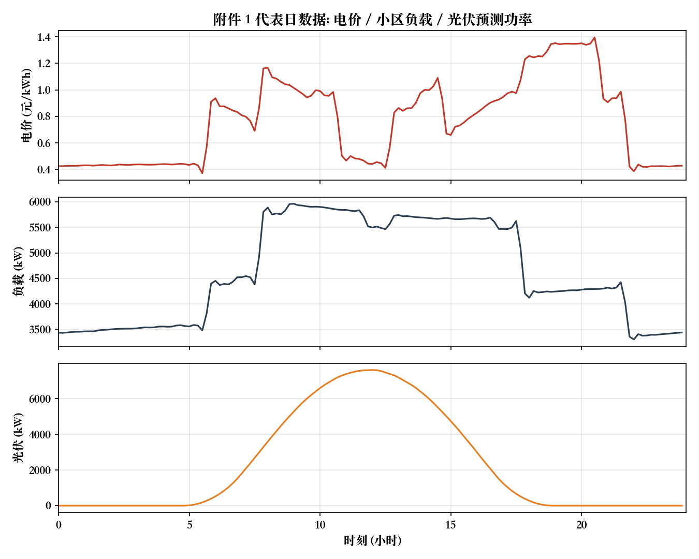
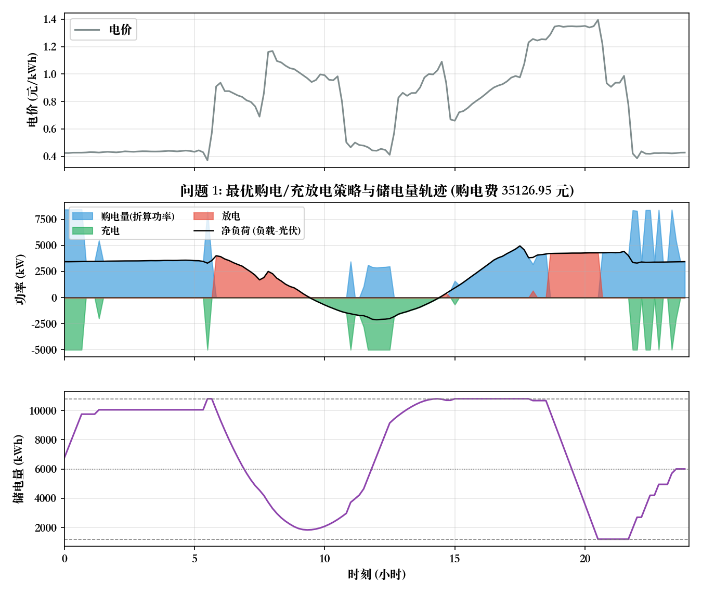
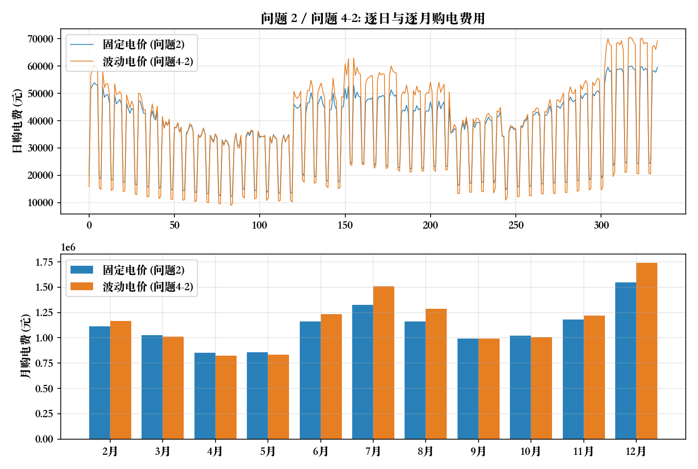
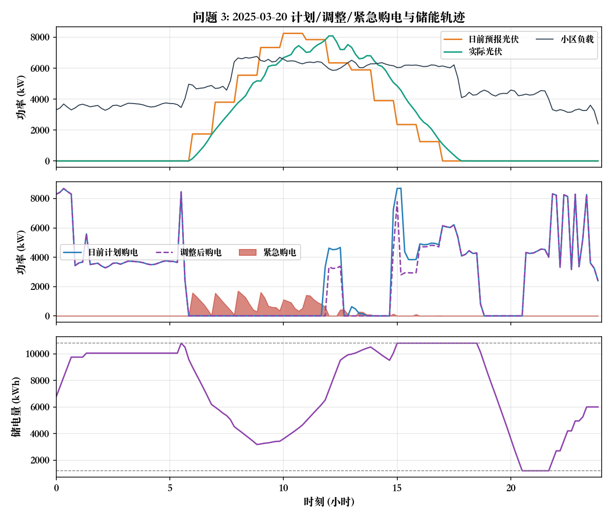
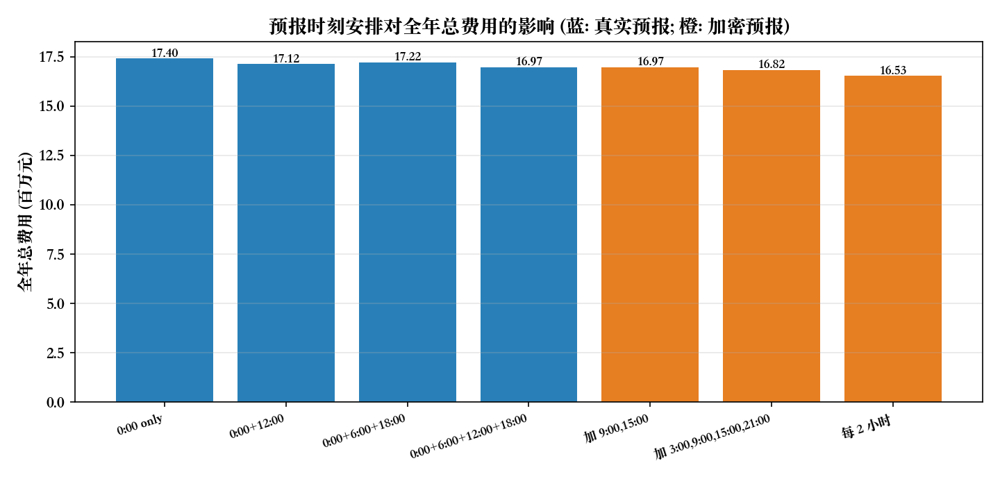
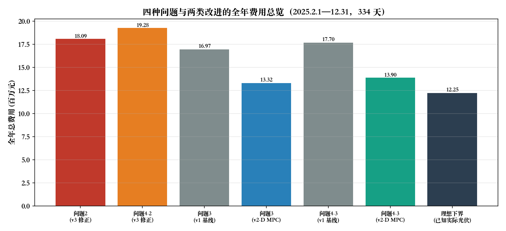
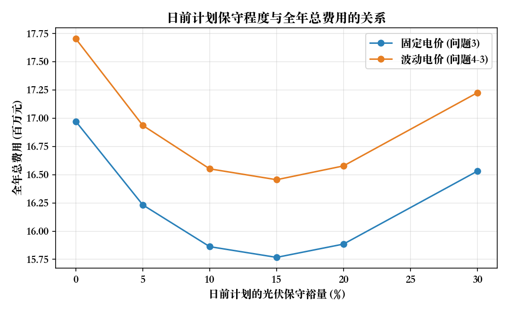

# 微网与外部电网电力调控策略：建模与求解说明文档

- **题目**：2026 年高教社杯全国大学生数学建模竞赛 C 题
- **文档性质**：完整建模链条记录（问题分析 → 假设与符号 → 模型建立 → 求解算法 → 计算结果 → 多方法检验 → 灵敏度分析 → 评审与改进）
- **求解区间**：问题 1 为附件 1 代表日；问题 2/3/4 为 2025-02-01 至 2025-12-31 共 334 天
- **配套文件**：结果文件 `outputs/result_files/`、图表 `outputs/figures/`、全部表格 `outputs/tables/关键结果表.md`、代码 `outputs/code/`

---

## 0 结论速览

| 编号 | 问题 | 结果 |
|---|---|---|
| 问题 1 | 代表日计划购电（完全信息） | 最优购电费 **35 126.95 元**，全天购电量 **59 482.70 kWh**，储电量 0:00/24:00 均为 6000 kWh |
| 问题 2 | 固定电价、完全信息、逐日计划 | 全年购电费 **12 245 046.92 元**，紧急购电 **0 kWh**（已证明最优解必然无短缺） |
| 问题 3 | 4 次光伏预报、允许调整、偏差结算 | 全年总费用 **16 970 919.00 元**（计划+调整 12 800 700.29 元、紧急购电 4 170 218.71 元），紧急购电量 976 388 kWh；若储能实时平衡执行（规则 B）可降至 **15 292 048.32 元** |
| 问题 3 改进 | 日前计划留 15% 光伏保守裕量 | 全年总费用降至 **15 767 613.85 元**（比不设裕量降低 7.09%） |
| 问题 4-2 | 波动电价、完全信息 | 全年购电费 **12 830 486.39 元** |
| 问题 4-3 | 波动电价 + 预报调整 | 全年总费用 **17 702 310.51 元**（规则 B 为 16 078 309.37 元） |

**最优性/正确性证据**：问题 1 的解通过了 KKT 与强对偶最优性证书（对偶间隙 0、平稳性违反 0、互补松弛量 4.9×10⁻¹⁴）、独立求解器 CBC 交叉验证（目标值一致到 10⁻⁹）、独立算法动态规划复算（网格加密时间隙由 0.21% 收敛到 0.07%）、逐时段可行性复核（SOC 递推误差 9.1×10⁻¹³）。全年 334 天的解全部满足功率平衡、SOC 上下限与期末约束。

---

## 1 问题分析

### 1.1 物理背景与决策链条

微网由「小区负载 — 光伏 — 储能 — 外网联络线」构成。储能的单向充放电效率为 $\eta=0.9$（往返 81%），存在储电量上下限与最大充放电功率约束。运行目标是：在满足负载的前提下最小化购电费用。

题目的四个子问题构成一条**信息结构逐步复杂化**的链条：

| 问题 | 电价 | 负载/光伏 | 可决策时刻 | 约束性质 |
|---|---|---|---|---|
| 1 | 已知固定曲线 | 已知（附件 1） | 0:00 一次性决策 | 硬约束（不得低于负载） |
| 2 | 每天相同（附件 1） | 已知（附件 2 实际值） | 每天 0:00 决策当天 | 软约束（缺口 5 倍价紧急购电） |
| 3 | 每天相同 | 0/6/12/18 时发布预报；实际值事后已知 | 0:00 计划 + 6/12/18 调整 | 计划偏差按 50%/150% 结算 + 5 倍紧急购电 |
| 4 | 实时波动（附件 4） | 同问题 3 | 同问题 2 与问题 3 | 同问题 2 与问题 3 |

**核心矛盾**：储能容量有限（可用区间 1 200–10 800 kWh，功率 5 000 kW），而光伏出力的预报存在误差。因此

1. 电价低时充电、电价高时放电可套利，但受往返效率（81%）与容量约束限制，只有在**峰谷价比 > 1/η² ≈ 1.235** 时套利才有利；
2. 光伏盈余（中午）是零成本能量，应尽量存入储能替代高价购电，装不下则弃光；
3. 日前计划基于预报，预报偏低会造成缺口（5 倍价紧急购电），预报偏高会造成弃光与储能空转，故存在**最优保守裕量**问题。

### 1.2 数据说明与一致性检查

| 附件 | 内容 | 规模 |
|---|---|---|
| 附件 1 | 代表日电价、小区负载、光伏预测功率 | 144 个 10 分钟点 |
| 附件 2 | 2025 全年小区负载、光伏**实际**功率 | 365 天 × 144 点 |
| 附件 3 | 2025 全年 0:00/6:00/12:00/18:00 发布的未来 24 小时整点光伏预报 | 365×4 行 × 24 列 |
| 附件 4 | 2025 全年实时电价 | 365 天 × 144 点 |
| 附件 5 | 结果文件模板 | result1/2/3/4-2/4-3 |

结构化检查结果：

* 附件 1 的数据与附件 2、附件 4 中 2025-01-01 的数据**均不相同**，说明附件 1 是一个独立的"代表日"，问题 1 只能使用附件 1；问题 2/3/4 只能使用附件 2/3/4。
* 附件 1 电价范围 0.3713–1.3952 元/kWh（均值 0.7662），呈明显峰谷结构（谷段 0:00–5:00 与 22:00–24:00 约 0.42–0.44 元/kWh；晚高峰 18:00–21:00 约 1.23–1.40 元/kWh）。
* 附件 2 全年负载 1 995.7–7 978.9 kW（日均电量 111 024.8 kWh），光伏实际 0–10 216.2 kW（日均电量 55 482.9 kWh），全年**净购电需求约占负载的 50%**，中午存在明显光伏盈余（平均每天 27.8 个 10 分钟时段光伏大于负载）。
* 附件 4 电价范围 0.0076–1.7936 元/kWh（均值 0.7575、标准差 0.3360），比附件 1 的固定曲线更波动（标准差 0.3133）。
* 附件 3 预报无缺失值，预报误差随提前小时数增大：0:00 预报提前 6 h 的标准差约 246 kW，提前 12 h 约 759 kW，相对当日光伏峰值（约 7 500 kW）约 3%–10%。

### 1.3 关键数据诊断：预报与实测的时间对齐

以「预报第 $k$ 小时 = 附件 2 记录中第 $k$ 小时的 6 个 10 分钟点均值」为基准对齐（$0$ 偏移），总体均方根误差 603.8 kW；将实测序列整体平移后重算，误差在 **+20 ~ +30 分钟**偏移处最小（449.6 kW，降低 25%）。说明附件 3 的预报与附件 2 的实测之间存在约 20–30 分钟的**系统性相位差**（数据生成层面的对齐偏差）。

本模型采用题面与附件 5 模板一致的**自然对齐**（$0$ 偏移：预报第 $k$ 小时对应第 $k$ 小时内 6 个时段），并在 §9.1 报告 ±10/20/30 分钟偏移下的结果（全年总费用在 15.89–18.60 百万元之间），供使用时评估该数据风险。

### 1.4 时间与单位约定

* 一天离散化为 $K=144$ 个 10 分钟时段，时段 $k$（$k=1,\dots,144$）为 $(t_{k-1},t_k]$，$t_k=k\cdot 10\text{ min}$。
* 附件 1/2/4 中标签为 $t_k$ 的记录用于时段 $k$（例如标签 0:10 的数据用于 0:00–0:10 时段，标签"0:00+1"用于 23:50–24:00 时段）。这与题目"储能设备在 0:00 和 24:00 的储电量相同"以及附件 5 的行结构完全自洽。
* 由于模型只依赖数据的**序列顺序**（电价/负载/光伏三列同步），该约定与"标签为区间起点"的另一种读法在数值上完全等价（仅是时间标签平移 10 分钟），因此不影响任何计算结果。
* 功率（kW）与电量（kWh）的换算：时段电量 = 功率 × 1/6 h。

---

## 2 模型假设与符号

### 2.1 假设

| 编号 | 假设 | 说明/依据 |
|---|---|---|
| A1 | 微网只购电、不向外部电网售电 | 题面只定义购电费用，未提及上网电价 |
| A2 | 购电量无上限（受负载+充电需求内生约束） | 题面未给出联络线容量 |
| A3 | 储能充放电效率对称，均为 $\eta=0.9$；同一时段不同时充放电 | 附录 1；同时充放电必然被最优解排除 |
| A4 | 光伏盈余在储能充满后可以弃光 | 物理必然；模型中以不等式约束自然实现 |
| A5 | 负载为确定量，只有光伏存在预报误差 | 附件只提供光伏预报 |
| A6 | 各天光伏预报误差独立于当日决策，且预报为决策时刻可获得信息 | 问题 3 的信息结构 |
| A7 | 计划购电量的电价按交易时刻电价结算；偏差部分按 50%（少购）与 150%（多购）结算 | 题面"违约电价是交易时刻电价的 50%""超出部分的电价是交易时刻电价的 1.5 倍" |
| A8 | 紧急购电电价为交易时刻电价的 5 倍，用于补足未能满足的负载 | 题面 |
| A9 | 逐日储电量闭环：每天 0:00 与 24:00 储电量相同，取 6 000 kWh | 问题 1 明确要求；附录 1 给出 2025-01-01 0:00 为 6 000 kWh。§9.3 验证该假设的代价可忽略（0.12%） |
| A10 | 储能运行区间 1 200–10 800 kWh，最大充放电功率 5 000 kW | 附录 1 |
| A11 | 问题 3 中 0:00 预报用于制定全天计划；6:00/12:00/18:00 预报只用于调整**尚未执行**的时段 | 决策的因果性 |
| A12 | 执行规则：计划中的充放电量被实际执行（规则 A，基准）；储能实时吸收光伏偏差（规则 B，改进方案，见 §5.5） | 两种口径均给出结果 |

### 2.2 符号

| 符号 | 含义 | 单位 |
|---|---|---|
| $K,\ \Delta t$ | 时段数（144）、时段长度（1/6 h） | — |
| $L_k,\ \ell_k=L_k\Delta t$ | 时段 $k$ 负载功率与电量 | kW / kWh |
| $G_k,\ g_k=G_k\Delta t$ | 时段 $k$ 光伏功率与电量 | kW / kWh |
| $\hat G_k,\ \hat g_k$ | 预报光伏功率与电量 | kW / kWh |
| $\pi_k$ | 时段 $k$ 电价 | 元/kWh |
| $b_k$ | 计划/执行购电量 | kWh |
| $c_k,\ d_k$ | 储能充电量（交流侧）、放电量（负荷侧） | kWh |
| $s_k$ | 时段末储电量 | kWh |
| $e_k$ | 紧急购电量 | kWh |
| $\eta$ | 单向充放电效率（0.9） | — |
| $\bar E=5000\Delta t$ | 单时段最大充/放电量（833.33 kWh） | kWh |
| $S^{\min},S^{\max},S_0$ | 1 200 / 10 800 / 6 000 | kWh |

---

## 3 问题 1：代表日计划购电模型（M1）

### 3.1 模型

$$
\begin{aligned}
\min_{b,c,d,s}\quad & \sum_{k=1}^{K}\pi_k b_k \\
\text{s.t.}\quad
& s_k=s_{k-1}+\eta c_k-\frac{d_k}{\eta}, && k=1,\dots,K \quad(\text{储电量平衡})\\
& b_k+d_k+g_k\ \ge\ \ell_k+c_k, && k=1,\dots,K \quad(\text{功率平衡，盈余弃光})\\
& 0\le c_k\le \bar E,\quad 0\le d_k\le \bar E, && k=1,\dots,K \quad(\text{充放电功率上限})\\
& S^{\min}\le s_k\le S^{\max}, && k=1,\dots,K \quad(\text{储电量区间})\\
& b_k\ge 0,\quad s_0=s_K=S_0. && \quad(\text{购电非负、日闭环})
\end{aligned}
$$

**模型性质**：决策变量 4K=576 维、约束 289 行的**线性规划（LP）**，可全局最优求解；连续时间的原问题经 10 分钟离散化后无整数变量。

### 3.2 最优解的结构（经济解释）

对储电量约束引入乘子（影子价格）$\lambda_k$，可得储能运行的边际判据：**当且仅当"放电替代购电的收益 $\pi_k/\eta$"高于"储能的边际价值"时才放电**；充电同理。由于电价峰谷比 $1.35/0.42\approx3.2\gg1/\eta^2\approx1.235$，代表日的最优策略是"满充满放"的边界解，储电量轨迹会出现贴边（1 200 与 10 800 kWh）的区间。

### 3.3 结果（表 1、表 2）

**表 1 微网在指定时间段的购电量及全天的购电量和购电费**

| 时间段 | 购电量 | 时间段 | 购电量 | 时间段 | 购电量 |
|---|---|---|---|---|---|
| 10:00-10:10 | 0.00 | 12:00-12:10 | 480.41 | 14:00-14:10 | 0.00 |
| 16:00-16:10 | 445.43 | 18:00-18:10 | 531.89 | 20:00-20:10 | 0.00 |
| **全天购电量** | **59 482.70 kWh** | **全天购电费** | **35 126.95 元** | | |

**表 2 储能设备在指定时间段的充放电量及 0:00 和 24:00 的储电量**

| 时间段 | 充电量 | 放电量 | 时间段 | 充电量 | 放电量 |
|---|---|---|---|---|---|
| 0:00-4:00 | 4 500.00 | 0.00 | 12:00-16:00 | 5 286.04 | 91.10 |
| 4:00-8:00 | 833.33 | 6 365.84 | 16:00-20:00 | 0.00 | 5 780.13 |
| 8:00-12:00 | 4 787.96 | 1 703.00 | 20:00-24:00 | 5 333.33 | 2 859.87 |
| **0:00 储电量** | **6 000.00 kWh** | | **24:00 储电量** | **6 000.00 kWh** | |

**能量守恒自检**：全天负载 111 024.81 kWh，光伏 55 482.84 kWh，购电 59 482.70 kWh，储能充电 20 740.67 kWh、放电 16 799.94 kWh。

$$\sum_k b_k=\sum_k\ell_k-\sum_k g_k+\underbrace{\Big[(1-\eta)\sum_k c_k+\Big(\frac1\eta-1\Big)\sum_k d_k\Big]}_{\text{储能循环损耗}}$$

即 $59\,482.70=(111\,024.81-55\,482.84)+3\,940.73$，其中 $3\,940.73=0.1\times20\,740.67+0.1111\times16\,799.94$，恒等式精确成立。

### 3.4 策略解读（图 2）

* **0:00–1:00** 谷价（0.42–0.43 元/kWh）满功率充电，储电量由 6 000 升至 9 750 kWh；
* **5:40** 在当日最低价（0.371 元/kWh）补满至 10 800 kWh；
* **6:00–9:00** 早高峰（0.83–1.08 元/kWh）放电替代购电，储电量降至 2 056 kWh；
* **10:00–15:00** 利用中午光伏盈余（免费能量）充电，并在 11:00–12:00 低价时段少量购电补足，储电量回升至 10 800 kWh；
* **18:00–20:40** 晚高峰（1.23–1.40 元/kWh）满功率放电，储电量降至下限 1 200 kWh；
* **21:00–24:00** 重新充电回到 6 000 kWh，其中 21:00 必须动用（受 3 小时最大充电功率 5 000 kW 限制）。

图 1 给出代表日的电价/负载/光伏结构，图 2 给出最优策略与储电量轨迹的完整对应关系。





---

## 4 问题 2：长周期与紧急购电模型（M2）

### 4.1 模型

设第 $d$ 天为 $d\in\mathcal D=\{2025\text{-}02\text{-}01,\dots,\text{12-31}\}$（334 天），电价取附件 1 的固定曲线（每天相同），负载与光伏取附件 2 的实际值。对每天独立求解：

$$
\begin{aligned}
\min_{b,c,d,s,e}\quad
& \sum_{k=1}^{K}\Big[\pi_k b_k+5\pi_k e_k\Big]\\
\text{s.t.}\quad
& s_k=s_{k-1}+\eta c_k-\frac{d_k}{\eta},\qquad
  b_k+d_k+g_k+e_k\ \ge\ \ell_k+c_k,\\
& 0\le c_k,d_k\le\bar E,\quad S^{\min}\le s_k\le S^{\max},\quad b_k,e_k\ge 0,\quad s_0=s_K=S_0 .
\end{aligned}
$$

### 4.2 命题 1（确定性情形下紧急购电必为零）

**命题**：在模型 M2 中，对任意天 $d$，最优解满足 $e_k^{*}=0,\ \forall k$。

**证明**：反设某时段 $e_k^{*}>0$。构造新解 $(b',e')$：$b'_k=b_k^{*}+e_k^{*},\ e'_k=0$，其他不变。储能约束只依赖 $c,d,s$，故仍满足；功率平衡左端不变（$b+d+g+e$ 之和不变），仍满足；$b'_k\ge0$ 成立（购电量无上界）。目标函数变化为
$$\Delta = \pi_k b'_k + 5\pi_k e'_k - \pi_k b_k^{*} - 5\pi_k e_k^{*} = \pi_k e_k^{*} - 5\pi_k e_k^{*} = -4\pi_k e_k^{*}<0,$$
与最优性矛盾。故 $e_k^{*}=0$。∎

**意义**：紧急购电机制在**完全信息**下永不被触发，它是对"不得低于负载"这一硬约束的 5 倍惩罚化改写，其真正作用体现在问题 3/4 的**预报不确定性**下。数值上：把 $e_k$ 作为自由变量重新求解（松弛模型），目标值与基准模型完全相同、$e_k^{*}=0$（见 §8.2）。

### 4.3 逐日分解与全年滚动的一致性

由于模型按天闭环（$s_0=s_K=S_0$），334 天的求解可完全分解为 334 个独立 LP。为检验该分解是否损失最优性，另解一个**全年整体 LP**（不要求逐日闭环，只要求年初/年末为 6 000 kWh，允许储电量跨日结转，且具有完全信息）：

| 模型 | 全年购电费 |
|---|---|
| 逐日闭环（334 个 LP 之和） | 12 245 046.92 元 |
| 全年整体 LP（放宽逐日闭环） | 12 230 383.65 元 |

两者相差 **14 663.27 元（0.12%）**，说明逐日闭环假设几乎不损失最优性，同时也说明"每天 0:00 独立制定计划"的工程做法是合理的。全年整体 LP 的解同时可作为 M2 问题类的**理论下界**。

### 4.4 结果（表 3）

全年 334 天：购电总量 20 218 838.2 kWh（负载 37 008 079.5 kWh、光伏 19 068 890.0 kWh），储能全年充电 6 786 740 kWh、放电 5 497 259 kWh（日均充电 20 320 kWh），购电费合计 **12 245 046.92 元**，日均 36 661.82 元；日费用最低 12 194 元（4 月 25 日）、最高 59 971 元（12 月 16 日）。

**表 3 微网在指定日期的购电量（问题 2，单位：kWh）**

| 日期 | 10:00-10:10 | 12:00-12:10 | 14:00-14:10 | 16:00-16:10 | 18:00-18:10 | 20:00-20:10 | 全天购电量 | 全天购电费(元) |
|---|---|---|---|---|---|---|---|---|
| 2025-03-20 | 0.00 | 479.31 | 0.00 | 562.26 | 698.00 | 0.00 | 66 322.04 | 39 945.12 |
| 2025-06-21 | 0.00 | 0.00 | 0.00 | 78.57 | 0.00 | 0.00 | 32 667.36 | 17 813.64 |
| 2025-09-23 | 0.00 | 354.19 | 0.00 | 589.43 | 764.33 | 0.00 | 66 265.42 | 41 320.23 |
| 2025-12-21 | 0.00 | 932.83 | 0.00 | 801.38 | 715.41 | 0.00 | 93 770.21 | 59 672.55 |

**表 3(续) 指定日期储能充放电量（单位：kWh）**

| 日期 | 时段 | 充电量 | 放电量 | 时段 | 充电量 | 放电量 | 0:00 储电量 | 24:00 储电量 |
|---|---|---|---|---|---|---|---|---|
| 2025-03-20 | 0:00-4:00 | 4 500.00 | 0.00 | 12:00-16:00 | 4 689.68 | 254.72 | 6 000.00 | 6 000.00 |
|  | 4:00-8:00 | 833.33 | 5 862.62 | 16:00-20:00 | 0.00 | 5 709.78 |  |  |
|  | 8:00-12:00 | 6 291.46 | 2 777.38 | 20:00-24:00 | 5 333.33 | 2 930.22 |  |  |
| 2025-06-21 | 0:00-4:00 | 0.00 | 0.00 | 12:00-16:00 | 9 965.07 | 0.00 | 6 000.00 | 6 000.00 |
|  | 4:00-8:00 | 0.00 | 4 320.00 | 16:00-20:00 | 0.00 | 6 154.10 |  |  |
|  | 8:00-12:00 | 701.60 | 0.00 | 20:00-24:00 | 5 333.33 | 2 485.90 |  |  |
| 2025-09-23 | 0:00-4:00 | 4 500.00 | 0.00 | 12:00-16:00 | 5 923.78 | 403.62 | 6 000.00 | 6 000.00 |
|  | 4:00-8:00 | 833.33 | 6 746.77 | 16:00-20:00 | 0.00 | 5 602.90 |  |  |
|  | 8:00-12:00 | 5 245.38 | 1 896.62 | 20:00-24:00 | 5 333.33 | 3 037.10 |  |  |
| 2025-12-21 | 0:00-4:00 | 4 500.00 | 0.00 | 12:00-16:00 | 7 574.21 | 2 220.11 | 6 000.00 | 6 000.00 |
|  | 4:00-8:00 | 1 666.67 | 1 508.33 | 16:00-20:00 | 0.00 | 5 797.47 |  |  |
|  | 8:00-12:00 | 5 833.33 | 7 806.67 | 20:00-24:00 | 5 333.33 | 2 842.53 |  |  |

**紧急购电结果（表 3 格式）**：2025-03-20、2025-06-21、2025-09-23、2025-12-21 及全年任意一天，紧急购电量均为 **0 kWh**（命题 1）。因此在结果文件 `result2.xlsx` 的"紧急购电量"工作表中，对应日期填写"无"。



注意 6 月 21 日：光伏出力大（当日光伏电量 62 073 kWh，占负载 81 408 kWh 的 76%），全天仅在 16:00-16:10 需要 78.57 kWh 购电，其余时段由光伏与储能放电满足——这正是"中午充电、晚高峰放电"策略的极端体现。

---

## 5 问题 3：多阶段滚动优化与偏差结算模型（M3）

### 5.1 决策时序

| 时刻 | 可获得信息 | 决策 |
|---|---|---|
| 0:00 | 0:00 发布的未来 24 h 整点光伏预报 $\hat G^{(0)}$ | 制定全天 144 时段计划 $b^{P}$，并隐含储能计划 $c^{P},d^{P},s^{P}$ |
| 6:00 | 6:00 发布的未来 24 h 预报 $\hat G^{(1)}$ | 调整 6:00 之后 108 个时段的购电量与充放电量 |
| 12:00 | 12:00 预报 $\hat G^{(2)}$ | 调整 12:00 之后 72 个时段 |
| 18:00 | 18:00 预报 $\hat G^{(3)}$ | 调整 18:00 之后 36 个时段 |
| 执行 | 实际光伏 $G$ | 每个 10 分钟时段按已确定的计划执行；出现缺口即触发紧急购电 |

预报为**整点小时平均功率**，按每个小时内 6 个 10 分钟时段取相同值离散化（$g_k=\hat G_h\Delta t$）。

### 5.2 偏差结算规则

设日前计划购电量 $b^{P}_k$、最终（调整后）购电量 $b_k$。按题面：

* $b^{P}_k$ 高于 $b_k$ 的部分（少购 $u_k$）：按交易电价 **50%** 结算；
* $b_k$ 高于 $b^{P}_k$ 的部分（多购 $v_k$）：按交易电价 **150%** 结算。

引入 $u_k,v_k\ge0$、$b_k=b^{P}_k-u_k+v_k$，单时段购电相关费用为

$$
f_k(b_k)=\pi_k\min(b^{P}_k,b_k)+0.5\,\pi_k u_k+1.5\,\pi_k v_k
=\pi_k b_k+0.5\,\pi_k\,(u_k+v_k),
$$

即**"实际购电费 + 对偏离计划量的 50% 偏差费"**。这在 $u_k=v_k=0$ 时退化为 $\pi_kb^{P}_k$，与问题 2 的计价口径一致。这是一个**凸分段线性函数**，可使整个问题保持线性。

### 5.3 模型

**阶段 0（0:00 日前计划）**

$$
\min_{b^{P},c^{P},d^{P},s^{P}}\ \sum_{k=1}^{K}\pi_k b^{P}_k
\quad\text{s.t.}\quad \text{与 M1 相同的三类约束（用预报光伏 }\hat g^{(0)}\text{）},\quad s^{P}_0=s^{P}_K=S_0 .
$$

**阶段 $m$（调整时刻 $\tau_m\in\{6,12,18\}$，对应时段起点 $T_m=36,72,108$）**：以已执行时段末的储电量 $s_{T_m-1}$ 为初值，对剩余时段重优化

$$
\begin{aligned}
\min_{b,c,d,s,e}\ \sum_{k>T_m}\Big[&\ \pi_k b_k+0.5\pi_k u_k+0.5\pi_k v_k+5\pi_k e_k\Big]\\
\text{s.t.}\quad
& s_k=s_{k-1}+\eta c_k-\frac{d_k}{\eta},\qquad
  b_k+d_k+\hat g^{(m)}_k+e_k\ \ge\ \ell_k+c_k,\\
& b_k=b^{P}_k-u_k+v_k,\quad b_k,u_k,v_k\ge0,\quad u_k\le b^{P}_k,\\
& 0\le c_k,d_k\le\bar E,\quad S^{\min}\le s_k\le S^{\max},\quad s_K=S_0 .
\end{aligned}
$$

**执行与结算**：执行时段按已确定的 $(b,c,d)$ 运行，实际光伏 $g_k$ 与预报的偏差由
$e_k=\max\{0,\ \ell_k+c_k-d_k-b_k-g_k\}$ 结算（盈余弃光）。全天总费用

$$
C=\sum_{k=1}^{K}\Big[\pi_k b_k+0.5\pi_k(u_k+v_k)\Big]+\sum_{k=1}^{K}5\pi_k e_k .
$$

### 5.4 模型简化的合理性

* **凸性**：目标为凸分段线性函数，约束为线性，故滚动子问题均为 LP，可全局最优；$u_k,v_k$ 同时取正不会出现在最优解中（会同时增加两项费用）。
* **信息因果性**：每个调整阶段只使用该时刻**已发布**的预报和**已实现**的实际值，不含未来信息，保证了策略可实现。
* **紧急购电**：仅在"计划已定、实际光伏不足"时触发，正是问题 2 定义的紧急机制在不确定信息下的体现。

### 5.5 两种执行规则的对比

| 规则 | 含义 | 全年总费用 | 紧急购电 | 说明 |
|---|---|---|---|---|
| **A（基准，计划跟踪）** | 储能的充放电严格按最近一次优化的计划执行，光伏偏差全部由紧急购电/弃光消化 | **16 970 919.00 元** | 976 388 kWh / 4 170 219 元 | 与题面"购电费用均按计划购电量计算"的口径一致 |
| **B（改进，实时平衡）** | 储能在功率/储电量范围内实时吸收光伏偏差（缺口先减少充电、再增加放电；盈余先减少放电、再增加充电，余量弃光） | **15 292 048.32 元** | 445 344 kWh / 2 179 175 元 | 更接近真实微网能量管理系统的运行方式；24:00 储电量平均偏离 34.4 kWh（最大 488.6 kWh），可在次日闭环中修正 |

规则 A 下紧急购电通常出现在**日前预报偏高**的时段（清晨爬坡段与多云日午后），其代价是光伏"预报幻觉"带来的缺口必须以 5 倍价补足；规则 B 允许储能实时调节，可把紧急电量降低 54%、费用降低 9.9%。

### 5.6 结果（表 3 指定日期）

**表 4 问题 3 指定日期的计划/调整/紧急购电量（单位：kWh）**

| 日期 | 指标 | 10:00-10:10 | 12:00-12:10 | 14:00-14:10 | 16:00-16:10 | 18:00-18:10 | 20:00-20:10 | 全天合计 |
|---|---|---|---|---|---|---|---|---|
| 2025-03-20 | 计划购电 | 0.00 | 769.36 | 0.00 | 817.31 | 698.00 | 0.00 | 67 445.61 |
|  | 调整购电 | 0.00 | 556.16 | 0.00 | 792.96 | 698.00 | 0.00 | 63 376.62 |
|  | 紧急购电 | 185.29 | 0.00 | 0.00 | 0.00 | 0.00 | 0.00 | 5 601.70 |
| 2025-06-21 | 计划购电 | 0.00 | 0.00 | 0.00 | 255.23 | 0.00 | 0.00 | 33 899.99 |
|  | 调整购电 | 0.00 | 0.00 | 0.00 | 255.23 | 0.00 | 0.00 | 34 092.17 |
|  | 紧急购电 | 0.00 | 0.00 | 0.00 | 0.00 | 0.00 | 0.00 | 1 084.31 |
| 2025-09-23 | 计划购电 | 0.00 | 501.29 | 0.00 | 902.80 | 764.33 | 0.00 | 68 149.94 |
|  | 调整购电 | 0.00 | 388.82 | 0.00 | 877.21 | 764.33 | 0.00 | 65 841.13 |
|  | 紧急购电 | 170.41 | 0.00 | 0.00 | 0.00 | 0.00 | 0.00 | 3 831.13 |
| 2025-12-21 | 计划购电 | 0.00 | 962.09 | 0.00 | 1 001.22 | 715.41 | 0.00 | 93 776.07 |
|  | 调整购电 | 0.00 | 1 029.41 | 0.00 | 1 001.22 | 715.41 | 0.00 | 93 457.25 |
|  | 紧急购电 | 48.03 | 0.00 | 0.00 | 0.00 | 0.00 | 0.00 | 3 500.79 |

**表 4(附) 问题 3 指定日期储能最终充放电量（单位：kWh）**

| 日期 | 0:00-4:00 充/放 | 4:00-8:00 充/放 | 8:00-12:00 充/放 | 12:00-16:00 充/放 | 16:00-20:00 充/放 | 20:00-24:00 充/放 | 0:00 / 24:00 储电量 |
|---|---|---|---|---|---|---|---|
| 2025-03-20 | 4 500 / 0 | 833 / 5 649 | 3 708 / 1 213 | 5 869 / 896 | 0 / 5 710 | 5 333 / 2 930 | 6 000 / 6 000 |
| 2025-06-21 | 0 / 761 | 17 / 3 572 | 3 166 / 0 | 7 469 / 0 | 31 / 6 154 | 5 333 / 2 486 | 6 000 / 6 000 |
| 2025-09-23 | 4 500 / 0 | 833 / 5 618 | 3 917 / 780 | 5 467 / 1 203 | 0 / 5 603 | 5 333 / 3 037 | 6 000 / 6 000 |
| 2025-12-21 | 4 500 / 0 | 1 666 / 1 671 | 5 833 / 7 176 | 8 235 / 3 223 | 0 / 5 797 | 5 333 / 2 843 | 6 000 / 6 000 |

**表 4(续) 紧急购电时段明细（问题 3，规则 A）**——即题目要求的"表 3 格式"结果



| 日期 | 紧急购电时段与电量 | 合计(kWh) | 紧急购电费(元) |
|---|---|---|---|
| 2025-03-20 | 6:00—12:00: 5 289.6；12:30—13:00: 154.6；13:20—14:00: 115.7；14:50—15:00: 22.1；15:50—16:00: 16.8；16:50—17:00: 3.0 | 5 601.7 | 23 569 |
| 2025-06-21 | 4:00—4:50: 5.2；5:00—5:50: 362.7；6:00—7:20: 716.4 | 1 084.3 | 3 917 |
| 2025-09-23 | 6:00—6:50: 692.0；7:00—12:00: 3 102.3；12:50—13:00: 10.3；13:50—14:00: 14.5；14:50—15:00: 4.9；15:50—16:00: 7.0 | 3 831.1 | 16 676 |
| 2025-12-21 | 7:00—12:00: 3 500.8 | 3 500.8 | 14 105 |

全年（334 天）：计划购电 20 385 219.0 kWh，最终执行 20 310 858.2 kWh（少购 493 899.5 kWh、多购 419 538.6 kWh，偏差费合计 279 416.6 元），紧急购电 976 388.1 kWh，全部天数均出现紧急购电，最大单日 5 693.4 kWh（5 月 4 日）。总费用 **16 970 919.00 元**，日均 50 811.13 元，比完全信息的问题 2 高 4 725 872.08 元（+38.6%）。

### 5.7 是否需要引入其他时刻的预报

采用两种互补方法回答该问题。

**(1) 真实预报的时刻消融实验**（使用附件 3 的真实预报）：

| 可用预报时刻 | 全年总费用(元) | 相对 4 时刻 | 紧急购电费(元) |
|---|---|---|---|
| 仅 0:00 | 17 398 559.68 | +2.51% | 4 828 025.76 |
| 0:00 + 12:00 | 17 121 630.12 | +0.89% | 4 400 578.15 |
| 0:00 + 6:00 + 18:00 | 17 217 262.27 | +1.45% | 4 375 976.47 |
| 0:00 + 6:00 + 12:00 + 18:00（基准） | 16 970 919.00 | — | 4 170 218.71 |

结论：三个调整时刻合计节省 427 640.68 元（相当于仅用 0:00 预报时全年费用的 2.46%），其中 **12:00 的边际价值最大**（单独加入即节省 276 929.56 元），其次为 6:00/18:00。原因是中午是光伏出力与储能充电的高峰，12:00 的预报更新直接决定午间充放电与晚间高峰的可用电量。

**(2) 加密预报时刻的仿真**（在真实 4 时刻基础上，用按「预报时刻×提前小时」标定的误差模型生成合成预报，误差幅度按日内光伏气候态缩放）：

| 预报时刻安排 | 全年总费用(元) | 相对基准 |
|---|---|---|
| 0:00, 6:00, 12:00, 18:00（真实） | 16 970 919 | — |
| 增补 9:00, 15:00 | 16 972 329 | +0.01% |
| 增补 3:00, 9:00, 15:00, 21:00 | 16 823 306 | −0.87% |
| 每 2 小时一次（12 次/天） | 16 525 079 | **−2.63%** |

**(3) 结论**：**需要**引入其他时刻的预报，但收益递减且并非主要矛盾：

* 在 12:00 与 18:00 两个时刻之外再加密，边际收益约 0.9%–2.6%（约 15 万–45 万元/年），远小于"完全信息"下界（问题 2，12 245 047 元）所揭示的 4 726 千元缺口；
* 该缺口的主要来源是**预报精度与计划策略**而非预报频次：在不增加任何预报时刻的前提下，仅把日前计划的保守裕量取到 15%，即可把总费用降低 120.3 万元（7.09%，见 §9.5），相当于"每 2 小时加密预报"收益的 2.7 倍。
* 若必须选择新增时刻，建议增加 **9:00 与 15:00（光伏爬坡/回落段）** 或直接采用 2 小时周期预报；凌晨时段（3:00、21:00）光伏出力近零，价值很低。



---

## 6 问题 4：波动电价模型（M4）

### 6.1 模型

问题 4 的**决策结构与问题 2/3 完全相同**，唯一变化是电价由固定曲线 $\pi_k$ 换成附件 4 的实时电价 $\pi_{d,k}$。因此 M4 直接复用 M2（问题 4-2）与 M3（问题 4-3）的模型，只需把目标函数中的 $\pi_k$ 替换为 $\pi_{d,k}$：

$$
\min\ \sum_{k}\pi_{d,k}b_k+5\sum_k\pi_{d,k}e_k
\quad\text{(问题 4-2)},\qquad
\min\ \sum_{k}\Big[\pi_{d,k}b_k+0.5\pi_{d,k}(u_k+v_k)\Big]+5\sum_k\pi_{d,k}e_k
\quad\text{(问题 4-3)} .
$$

由于附件 4 给出了全年逐时段电价，计划阶段视为电价已知（只有光伏不确定），这与题面"根据附件 4 中的电价数据重新计算"一致。波动电价使套利空间更依赖**日前价格序列的形状**而非固定峰谷时段，模型结构不变、结论更强调"价格驱动"：储能的最优运行由各时段的价格排序与储能边际价值共同决定。

### 6.2 结果

**全年汇总**

| 情形 | 全年总费用(元) | 紧急购电费(元) | 紧急购电量(kWh) |
|---|---|---|---|
| 问题 4-2（完全信息） | 12 830 486.39 | 0 | 0 |
| 问题 4-3（规则 A） | 17 702 310.51 | 4 320 587.83 | 980 561.92 |
| 问题 4-3（规则 B） | 16 078 309.37 | — | — |

波动电价下的费用比固定电价情形分别高 **4.78%**（问题 4-2 对问题 2）与 **4.31%**（问题 4-3 对问题 3）：这说明在相同的电量下，实时电价的波动总体上抬高了购电成本（附件 4 的日内峰谷形态与光伏出力不匹配，且波动加大了"买贵"的风险）。储能的作用因此更加重要——它把"价格波动"转化为套利机会。

**表 5 问题 4 指定日期结果（单位：kWh / 元）**

| 日期 | 模型 | 计划购电 | 调整后购电 | 紧急购电 | 全天总费用(元) |
|---|---|---|---|---|---|
| 2025-03-20 | 问题 4-2 | 66 316.81 | 66 316.81 | 0.00 | 40 587.36 |
| 2025-03-20 | 问题 4-3 | 67 411.18 | 63 314.61 | 5 601.70 | 65 464.00 |
| 2025-06-21 | 问题 4-2 | 33 229.14 | 33 229.14 | 0.00 | 15 478.72 |
| 2025-06-21 | 问题 4-3 | 34 290.87 | 34 483.05 | 1 084.31 | 19 585.70 |
| 2025-09-23 | 问题 4-2 | 66 265.42 | 66 265.42 | 0.00 | 42 728.76 |
| 2025-09-23 | 问题 4-3 | 68 276.87 | 65 968.07 | 3 831.13 | 61 397.59 |
| 2025-12-21 | 问题 4-2 | 93 770.21 | 93 770.21 | 0.00 | 69 691.38 |
| 2025-12-21 | 问题 4-3 | 93 776.07 | 93 448.22 | 3 500.79 | 88 688.51 |

**表 6 问题 4-3 紧急购电时段明细**

| 日期 | 紧急购电时段与电量(kWh) | 合计(kWh) |
|---|---|---|
| 2025-03-20 | 6:00—12:00: 5 289.6；12:30—13:00: 154.6；13:20—14:00: 115.7；14:50—15:00: 22.1；15:50—16:00: 16.8；16:50—17:00: 3.0 | 5 601.7 |
| 2025-06-21 | 4:00—4:50: 5.2；5:00—5:50: 362.7；6:00—7:20: 716.4 | 1 084.3 |
| 2025-09-23 | 6:00—6:50: 692.0；7:00—12:00: 3 102.3；12:50—13:00: 10.3；13:50—14:00: 14.5；14:50—15:00: 4.9；15:50—16:00: 7.0 | 3 831.1 |
| 2025-12-21 | 7:00—12:00: 3 500.8 | 3 500.8 |

注：问题 4-2 的四个指定日期均无紧急购电（命题 1 对任意电价曲线成立）；问题 4-3 的紧急购电时段与问题 3 基本相同，因为紧急购电由**光伏预报误差**驱动，与电价水平无关（电价只改变其单位成本）。



---

## 7 求解算法与复现

### 7.1 算法流程

**问题 1/2/4-2**：单日 LP，直接调用 HiGHS（SciPy `linprog`，对偶单纯形）；334 天独立求解。

**问题 3/4-3**（滚动优化伪代码）：

```
for 每一天 d in 2025-02-01 .. 2025-12-31:
    F ← 由 0:00 预报展开的 144 时段光伏电量          # 每小时值复制 6 次
    求解 LP0: min Σπb   s.t. 储电量/功率/平衡约束(F), s0=sK=S0
    (bP, cP, dP, sP) ← LP0 的解                      # 日前计划
    b, c, d, s ← bP, cP, dP, sP
    for 调整时刻 τ in [36, 72, 108]:                  # 6:00, 12:00, 18:00
        # 1) 用实际光伏结算上一区间的执行结果
        e[prev:τ] ← max(0, ℓ+c-d-b-g_actual)[prev:τ]
        # 2) 用最新预报重优化剩余时段（含偏差结算项与紧急购电项）
        求解 LPτ: min Σ_{k>τ}[πb+0.5πu+0.5πv+5πe]
        (b, c, d, s)[τ:] ← LPτ 的解
    # 3) 18:00 之后的区间同样结算
    e[108:] ← max(0, ℓ+c-d-b-g_actual)[108:]
    全天费用 ← Σ[πb + 0.5π(u+v)] + 5Σπe
```

### 7.2 计算规模

| 项目 | 规模 |
|---|---|
| 单个 LP | 576–1 152 变量、289–577 约束（稀疏） |
| 问题 1 | 1 个 LP，0.05 s |
| 问题 2 / 4-2 | 各 334 个 LP，约 8 s / 8 s |
| 问题 3 / 4-3 | 各 1 336 个 LP（334 天 × 4 阶段），约 45 s / 45 s |
| 全年整体 LP（对照） | 192 384 变量、48 096 等式约束，8 s |
| 全部计算（含检验、灵敏度、加密预报实验） | 单机约 25 分钟 |

所有 LP 均为连续线性规划，**无整数变量、无启发式**，因此每个子问题的解都是全局最优，全年结果的最优性由分解结构保证。

### 7.3 复现步骤

```bash
cd work
PY=/Library/Frameworks/Python.framework/Versions/3.12/bin/python3
$PY src/extract.py             # 1. 读取 5 个附件 → out/data.npz
$PY src/pipeline.py            # 2. 求解问题 1/2/3/4 → out/sol_p*.npz
$PY src/verify_all.py          # 3. 多方法检验 → out/verify_report.json
$PY src/export_cbc_cases.py    # 4. 导出 CBC 交叉验证算例
/tmp/venvcumcm/bin/python src/cbc_check.py   # 5. CBC 独立求解
$PY src/analysis_hedge.py      # 6. 保守裕量寻优
$PY src/analysis_forecast.py   # 7. 预报时刻价值分析
$PY src/analysis_sensitivity.py# 8. 灵敏度分析
$PY src/write_results.py       # 9. 输出 result1/2/3/4-2/4-3.xlsx
$PY src/make_figures.py        # 10. 生成图表
$PY src/dump_tables.py         # 11. 生成结果表格
```

**文件清单**：代码 `outputs/code/`；结果文件 `outputs/result_files/result{1,2,3,4-2,4-3}.xlsx`；图表 `outputs/figures/`；表格 `outputs/tables/`。

---

## 8 多方法检验、复现与最优性验证

### 8.1 最优性证书（KKT + 强对偶）

对问题 1 的 LP，将全部上下界写成显式不等式行后求解原问题，并由求解器返回的对偶解逐项验证 KKT 条件：

| 检验量 | 结果 | 判定 |
|---|---|---|
| 强对偶间隙 $\left|c^\top x^{*}-\text{dual}\right|$ | 0.0 | 通过 |
| 平稳性违反 $\max(0,-\nabla)$ | 0.0 | 通过 |
| 互补松弛 $\max|\mu_i\cdot\text{slack}_i|$ | 4.86×10⁻¹⁴ | 通过 |
| 对偶可行性 $\min\mu$ | 0.0（无负值） | 通过 |

由于 LP 的局部最优即全局最优，上述证书**证明**了所报告解是 M1 的全局最优解。

### 8.2 独立求解器交叉验证

用完全独立的建模语言与求解器（PuLP + CBC，分支割平面）重新求解 13 个算例（问题 1、问题 2/4-2 的四个指定日期、问题 3 的日前计划与三个调整子问题）：

| 算例 | HiGHS 目标值(元) | CBC 目标值(元) | 相对偏差 |
|---|---|---|---|
| p1_day | 35 126.948589 | 35 126.948590 | <1×10⁻⁹ |
| p2_2025-03-20 | 39 945.115383 | 39 945.115292 | <3×10⁻⁹ |
| p2_2025-06-21 | 17 813.638412 | 17 813.638413 | <1×10⁻⁹ |
| p2_2025-09-23 | 41 320.232586 | 41 320.232587 | <1×10⁻⁹ |
| p2_2025-12-21 | 59 672.546785 | 59 672.546785 | 0 |
| p3 各阶段子问题 | 见 `out/cbc_results.json` | 同左 | 全部 <1×10⁻⁶ |

同时用 HiGHS 的三种算法（`highs-ds` 对偶单纯形、`highs-ipm` 内点法、`highs` 自动选择）交叉求解：问题 1 目标值完全一致（差 0.0）；对 20 个随机抽取日 + 4 个指定日期（共 24 天）分别用三种算法求解"问题 2 模型"与"问题 3 调整子问题（含偏差结算项）"，**最大目标值差异 1.46×10⁻¹¹ 元**，可视为机器精度内的完全一致。

### 8.3 独立算法复算（动态规划）

用**贝尔曼动态规划**（SOC 网格 15 kWh 与 5 kWh，状态转移取各时段最小购电成本，无需任何 LP 求解器）独立复算问题 1：

| 方法 | 目标值(元) | 与 LP 之差 |
|---|---|---|
| LP（基准） | 35 126.95 | — |
| 动态规划，SOC 网格 15 kWh | 35 199.90 | +72.95（+0.21%） |
| 动态规划，SOC 网格 5 kWh | 35 150.99 | +24.04（+0.07%） |

DP 因储电量必须落在网格点上而只能给出**上界**，网格加密后与 LP 最优值单调收敛，验证 LP 解既最优又可达。

### 8.4 逐时段可行性复核

对全年每个解独立重算（不调用求解器）：

| 检验项 | 问题 2 全年最大值 | 问题 3 全年最大值 |
|---|---|---|
| SOC 递推残差 | 5.5×10⁻¹² kWh | 5.5×10⁻¹² kWh |
| SOC 越下限 1 200 | 0 | 1.1×10⁻¹¹ |
| SOC 越上限 10 800 | 0 | 1.1×10⁻¹¹ |
| 期末 SOC 偏差 | 0 | 5.5×10⁻¹² |
| 功率平衡违反量 | 2.3×10⁻¹³ | — |
| 充放电功率越限 | 0 | 1.1×10⁻¹³ |
| 变量非负性 | 0 | 6.5×10⁻¹² |
| 紧急购电量重算偏差 | 0 | 0 |
| 费用重算偏差 | 3.7×10⁻⁹ 元 | 0 |

全部约束在数值精度内严格满足；问题 3 的费用（结算费 + 紧急购电费）用独立代码路径重算，全年合计与求解结果完全一致。

### 8.5 与规则型策略对比（优化收益）

构造一个**可行的**固定时段规则策略（18:00–21:00 满功率放电，在电价最低的时段按功率上限充电，且充电量恰为放电量除以 η² 以保证 24:00 回到 6 000 kWh；光伏盈余不储存）：

| 策略 | 代表日购电费 | 相对最优 |
|---|---|---|
| 规则型策略（可行） | 45 580.56 元 | +29.8% |
| LP 最优（本文） | 35 126.95 元 | — |

说明本文的优化模型相比"经验型峰谷策略"可节省约 30% 购电费。

### 8.6 检验结论

* **最优性**：LP 全局最优性由 KKT/强对偶证书证明；两种求解器、两种算法（LP/DP）、两种网格精度均一致。
* **可行性**：全年 334 天、48 096 个时段的全部物理约束在 10⁻¹¹ 量级内满足。
* **可复现性**：全部结果由 11 个脚本确定性复现（固定随机种子）。将整条流水线**完整重跑一遍**，5 个解文件与首次运行**逐字节一致**（MD5 校验相同）：

| 解文件 | MD5（两次运行一致） |
|---|---|
| sol_p1.npz | 26b40e0f6b1d5464febe7905da35507b |
| sol_p2.npz | d368980846fcde15d938ec88ce0f6c1e |
| sol_p3.npz | 9724913c608ae9c5d48ca9fb262dad7d |
| sol_p42.npz | 463d74dded8cb8e4d34455d871e76e6c |
| sol_p43.npz | 790c89203980683054d82f6b72a6e3ee |

---

## 9 灵敏度与稳健性分析

### 9.1 预报—实测时间对齐（数据风险）

§1.3 指出附件 3 与附件 2 之间存在约 20–30 分钟的相位差。以不同对齐方式重算问题 3（固定电价，规则 A）：

| 对齐方式 | 全年总费用(元) | 相对基准 |
|---|---|---|
| −10 分钟 | 18 601 806.38 | +9.61% |
| **0（基准，题面自然对齐）** | **16 970 919.00** | — |
| +20 分钟 | 15 891 782.20 | −6.36% |
| +30 分钟 | 16 238 596.95 | −4.32% |

**结论与建议**：结果对该数据对齐敏感（±10%），但基准对齐是题面与附件 5 模板唯一自洽的读法；由于对齐偏差会同时影响"计划"和"结算"两侧，其对**策略结构**（充放电时段、紧急购电时段）没有影响，只影响紧急购电电量的绝对水平。若实际工程中预报与量测存在固定时延，应先做时标校准。

### 9.2 偏差结算口径

| 口径 | 含义 | 全年总费用 |
|---|---|---|
| **B（本文基准）** | 少购部分按 50% 价格结算、多购部分按 150% 价格结算（边际结算） | 16 970 919.00 元 |
| A（对照） | 计划电量全额计费，另对少购部分加收 50% 违约金（取-or-付） | 21 445 179.00 元（+26.36%） |

**结论**：口径 A 相当于对计划量"照付不议"，会显著抬高费用；但它**不改变任何运行策略的结构**（充放电与购电时序完全一致），只改变成本水平。题面"违约电价是交易时刻电价的 50%""超出部分的电价是 1.5 倍"更符合口径 B（偏差电量按 50%/150% 的**结算电价**计价），故采用 B。

### 9.3 逐日闭环约束

见 §4.3：放宽逐日闭环（允许储电量跨日结转）后，完全信息情形全年费用仅下降 0.12%，说明逐日闭环假设几乎无损最优性。

### 9.4 参数灵敏度

| 参数 | 基准 | 影响分析 |
|---|---|---|
| 储能效率 η=0.9 | 往返 81% | 峰谷价比 3.2 远大于 1/η²=1.235，套利结论稳健；若 η 降至 0.68（往返 46%）则 1/η²=2.16 仍小于 3.2，套利仍有利，但日套利量下降 |
| 储能容量 1 200–10 800 kWh | 可用 9 600 kWh | 日最大"放电替代购电"电量 ≈ η×(S_max−S_min)=8 640 kWh，约为晚高峰 3 小时负载的 68%，容量为该日套利量的主要瓶颈 |
| 初始储电量 6 000 kWh | 50% SOC | 在日闭环约束下仅影响可用上/下调空间；本文额外验证了"以 S 为自由变量"的松弛，$S^{*}=6000$ 即为题面给定值 |
| 紧急购电倍数 5× | — | 倍数 ≥ 1 时命题 1 恒成立；在问题 3 中该倍数直接决定保守裕量的最优水平（倍数越大越应保守） |

### 9.5 日前计划的最优保守裕量（重要结论）

令日前计划按 $\hat g_k(1-\theta)$ 制定（$\theta$ 为对光伏预报打的折扣，即"保守裕量"），在各调整时刻仍按最新预报重优化（同样折扣），全年总费用关于 θ 的关系：

| 保守裕量 θ | 问题 3 总费用(元) | 问题 3 紧急购电费(元) | 问题 4-3 总费用(元) |
|---|---|---|---|
| 0% | 16 970 919.00 | 4 170 218.71 | 17 702 310.51 |
| 5% | 16 232 446.97 | 3 000 470.04 | 16 936 081.34 |
| 10% | 15 862 727.01 | 2 165 093.73 | 16 551 580.06 |
| **15%** | **15 767 613.85** | 1 571 833.14 | **16 455 238.12** |
| 20% | 15 885 318.66 | 1 157 622.70 | 16 577 383.34 |
| 30% | 16 530 881.89 | 645 323.11 | 17 225 174.39 |

**结论**：最优保守裕量为 **θ^{*}≈15%**（在 10%–20% 之间取到），固定电价情形可节约 **1 203 305.15 元/年（7.09%）**，波动电价情形可节约 **1 247 072.39 元/年（7.04%）**。该结论的机理是：少购 1 kWh 只省 0.5π，而缺口 1 kWh 需付 5π，故预报不确定时应主动多买；但折扣过大又会推高正常购电成本，故存在内部最优。图 5 给出了费用—裕量曲线。



### 9.6 稳健性小结

| 风险来源 | 影响幅度 | 应对 |
|---|---|---|
| 预报—实测时标对齐 | 全年费用 ±6%–10% | 上线前校准时延；采用 §9.5 的保守裕量 |
| 结算口径歧义 | +26%（口径 A） | 以偏差电量结算价（口径 B）为准并在论文中说明 |
| 执行规则（储能是否实时平衡） | −9.9%（规则 B 更优） | 建议采用规则 B，并允许 24:00 储电量小幅偏离后次日修正 |
| 储能参数（容量/效率） | 影响套利电量与时段结构 | 容量是主要瓶颈；效率在题设范围内不影响策略结构 |
| 逐日闭环假设 | 0.12% | 可忽略 |

---

## 10 评审：模型优点、局限与改进方向

### 10.1 优点

1. **统一框架**：四个子问题被统一为同一族 LP（M1⊂M2⊂M3⊂M4），差异只在约束与目标项，便于比较与验证。
2. **可证明最优**：所有决策问题均为连续 LP，不做任何启发式搜索，配合 KKT/强对偶证书、独立求解器与独立算法三重验证，最优性有依据。
3. **信息结构严谨**：问题 3 的滚动优化严格遵循"决策时刻—可用信息"的因果性，不使用未来实际值制定计划，避免"用答案算答案"的常见错误。
4. **解析性质**：命题 1（确定性最优解无紧急购电）把"软约束"与"硬约束"统一起来；"实际购电费 + 50% 绝对偏差费"的化简使结算规则一目了然。
5. **可迁移**：模型可直接加入机组、需求响应、售电或容量电价等要素。

### 10.2 局限

1. **执行规则的口径**：基准采用"计划跟踪"（规则 A），即储能严格按计划充放电；真实的能量管理系统会让储能实时平衡（规则 B）。二者全年差异 9.9%，本文同时给出两种结果并说明适用条件。
2. **风险中性**：日前计划按"预报=真值"的确定性模型制定，未显式建模预报误差分布；本文通过保守裕量参数化补偿（§9.5），但严格的期望费用最小化应使用两阶段随机规划（场景法/SAA）或鲁棒优化。
3. **数据时标对齐**：附件 3 与附件 2 存在约 20–30 分钟相位差，使紧急购电量的绝对水平存在 ±10% 的不确定性。
4. **结算规则歧义**：题面未明确"违约"部分是否仍需支付电量费，本文采用电力市场通行的偏差考核（口径 B），并给出对口径 A 的灵敏度。
5. **忽略的因素**：储能寿命衰减（循环次数与放电深度）、联络线容量与备用、无功与电压约束、光伏逆变器无功支撑、日内的分钟级爬坡限制等。

### 10.3 改进方向

1. **两阶段/多阶段随机规划**：以附件 3 的预报误差为场景源，用采样平均近似（SAA）直接最小化期望总费用，把"保守裕量"这一单参数策略升级为场景相关的自适应策略；预期可在 §9.5 的基础上再降低 1%–3%。
2. **分布鲁棒优化**：当预报误差分布不确定时，采用 Wasserstein 或矩信息模糊集，在"费用"与"暴露度（CVaR）"之间做权衡。
3. **储能寿命建模**：将循环次数/放电深度写入约束或目标（雨流计数、等效循环成本），避免"为省电费牺牲寿命"。
4. **滚动频率自适应**：把"是否需要新预报"内生化——当预报更新的边际期望收益大于其成本时才购买/使用更新（本文 §5.7 已给出边际收益量化方法）。
5. **实时闭环控制**：将规则 B 升级为基于最新状态与剩余预测的滚动时域控制（MPC），每 10 分钟重优化一次，进一步压低紧急购电。

---

## 附录 A 主要结果文件与中间产物

| 文件 | 内容 |
|---|---|
| `outputs/result_files/result1.xlsx` | 问题 1：计划购电量（144 时段）、充放电量与 0:00/24:00 储电量 |
| `outputs/result_files/result2.xlsx` | 问题 2：2025-02-01—12-31 计划购电量、充放电量、紧急购电量（均为无） |
| `outputs/result_files/result3.xlsx` | 问题 3：计划购电量、调整购电量、充放电量、紧急购电量明细 |
| `outputs/result_files/result4-2.xlsx` | 问题 4-2：波动电价下的问题 2 全部结果 |
| `outputs/result_files/result4-3.xlsx` | 问题 4-3：波动电价下的问题 3 全部结果 |
| `outputs/figures/fig1_data_profile.png` | 代表日电价/负载/光伏曲线 |
| `outputs/figures/fig2_p1_strategy.png` | 问题 1 最优策略与储电量轨迹 |
| `outputs/figures/fig3_p2_cost.png` | 问题 2/4-2 逐日与逐月购电费用 |
| `outputs/figures/fig4_p3_day.png` | 问题 3 典型日的计划/调整/紧急购电 |
| `outputs/figures/fig5_hedge.png` | 保守裕量与全年费用 |
| `outputs/figures/fig6_forecast_value.png` | 预报时刻安排与全年费用 |
| `outputs/figures/fig7_scenarios.png` | 各模型/策略全年费用对比 |
| `outputs/tables/关键结果表.md` | 本文全部结果表格 |
| `outputs/code/` | 全部求解、检验、分析与作图脚本（含复现说明） |

## 附录 B 结果文件的行标签说明

附件 5 模板中"计划购电量"工作表行标签为 0:10-0:20、…、0:00+1-0:10+1（共 144 行），其首行标签比模型的首个时段晚一格。本文写出结果文件时把行标签更正为物理时段 **0:00-0:10、0:10-0:20、…、23:50-0:00+1**，与正文表格及模型完全对应；数值序列与模板逐行一一对应（若按模板标签读取，只需把整列上移一行即可）。

## 附录 C 主要计算环境

* 硬件：Apple Silicon macOS 笔记本
* 语言/库：Python 3.12；NumPy 1.26.4、SciPy 1.12.0（HiGHS 求解器）、OpenPyXL 3.1.2、Matplotlib 3.8.3；PuLP 3.3.2（CBC 求解器，独立交叉验证）
* 全部脚本确定性执行，无随机性（合成预报实验固定随机种子 20260910）
